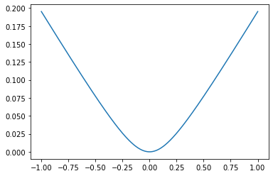

.. code:: python

    import tensorflow.compat.v1 as tf
    import os
    import io
    import time
    import matplotlib.pyplot as plt

.. code:: python

    tf.disable_eager_execution()
    tf.disable_v2_behavior()
    sess = tf.Session()
    summary_writer = tf.summary.FileWriter('tensorboard',tf.get_default_graph())
    if not os.path.exists('tensorboard'):
        os.makedirs('tensorboard')

.. code:: python

    import numpy as np
    x_vals = np.array([1.,3.,5.,7.,9.])
    x_data = tf.placeholder(tf.float32)
    m_const = tf.constant(3.)
    my_product = tf.multiply(x_data,m_const)
    for _ in x_vals:
        print(sess.run(my_product, feed_dict={x_data: _}))

.. parsed-literal::

    3.0
    9.0
    15.0
    21.0
    27.0

.. code:: python

    # 知道如何将运算符连接起来很重要。为了便于展示，我们在

.. code:: python

    my_array = np.array([[1.,3.,5.,7.,9.], [-2.,0.,2.,4.,6.], [-6., -3., 0., 3.,6.]])
    x_vals = np.array([my_array, my_array+1])
    x_data = tf.placeholder(tf.float32, shape=(3,5))
    x_vals

.. parsed-literal::

    array([[[ 1.,  3.,  5.,  7.,  9.],
            [-2.,  0.,  2.,  4.,  6.],
            [-6., -3.,  0.,  3.,  6.]],
    
           [[ 2.,  4.,  6.,  8., 10.],
            [-1.,  1.,  3.,  5.,  7.],
            [-5., -2.,  1.,  4.,  7.]]])

.. code:: python

    m1 = tf.constant([[1.], [0.], [-1.], [2.], [4.]])
    m2 = tf.constant([[2.]])
    a1 = tf.constant([[10.]])

.. code:: python

    m1

.. parsed-literal::

    <tf.Tensor 'Const_8:0' shape=(5, 1) dtype=float32>

.. code:: python

    m2

.. parsed-literal::

    <tf.Tensor 'Const_9:0' shape=(1, 1) dtype=float32>

.. code:: python

    a1

.. parsed-literal::

    <tf.Tensor 'Const_10:0' shape=(1, 1) dtype=float32>

.. code:: python

    prod1 = tf.matmul(x_data, m1)
    prod2 = tf.matmul(prod1, m2)
    add1 = tf.add(prod2,a1)

.. code:: python

    for x_val in x_vals:
        print(sess.run(add1, feed_dict={x_data: x_val}))

.. parsed-literal::

    [[102.]
     [ 66.]
     [ 58.]]
    [[114.]
     [ 78.]
     [ 70.]]

.. code:: python

    Prod1 = np.matmul(my_array,np.array([[1.], [0.], [-1.], [2.], [4.]]))

.. code:: python

    Prod2 = np.matmul(Prod1, np.array([2.]))

.. code:: python

    add1 = np.add(Prod2, 10)

.. code:: python

    add1

.. parsed-literal::

    array([102.,  66.,  58.])

.. code:: python

    # 多层操作

.. code:: python

    x_shape = [1,4,4,1]
    x_val = np.random.uniform(size = x_shape)

.. code:: python

    x_data = tf.placeholder(tf.float32, shape = x_shape)
    my_filter = tf.constant(0.25, shape= [2,2,1,1])
    my_strides = [1,2,2,1]
    mov_avg_layer = tf.nn.conv2d(x_data, my_filter, my_strides, padding='SAME', name= 'Moving_Avg_Window')

.. code:: python

    def custom_layer(input_matrix):
        input_matrix_squeezed  = tf.squeeze(input_matrix)
        A = tf.constant([[1., 2.], [-1., 3.]])
        b = tf.constant(1., shape=[2,2])
        temp1 = tf.matmul(A, input_matrix_squeezed) # Ax
        temp = tf.add(temp1,b) # Ax+b
        return (tf.sigmoid(temp))

.. code:: python

    with tf.name_scope('Custom_Layer') as scope:
        custom_layer1 = custom_layer(mov_avg_layer)

.. code:: python

    print(sess.run(custom_layer1, feed_dict= {x_data: x_val}))

.. parsed-literal::

    [[0.93812907 0.9418925 ]
     [0.9348625  0.905745  ]]

.. code:: python

    mov_avg_layer

.. parsed-literal::

    <tf.Tensor 'Moving_Avg_Window_1:0' shape=(1, 2, 2, 1) dtype=float32>

.. code:: python

    # Implementing loss functions

.. code:: python

    x_vals = tf.linspace(-1., 1., 500)
    target = tf.constant(0.)

.. code:: python

    # L2 norm loss is the Euclidean loss function. Advantages: very smmoth near the target and algorithms can use this fact to converge to 
    # the taraget more slowly, the closer it gets, as follows

.. code:: python

    l2_y_vals = tf.square(target-x_vals)
    x_vals_out = sess.run(x_vals)
    l2_y_out = sess.run(l2_y_vals)

.. code:: python

    plt.plot(x_vals_out, l2_y_out)

.. parsed-literal::

    [<matplotlib.lines.Line2D at 0x7faa56261af0>]

.. code:: python

    x_vals_1 = tf.linspace(-1., 500., 1000)
    target_1 = tf.constant(0.)
    l2_y_vals_1 = tf.square(target_1- x_vals_1)
    l2_y_out_1 = sess.run(l2_y_vals_1)
    plt.plot(sess.run(x_vals_1), l2_y_out_1)

.. parsed-literal::

    [<matplotlib.lines.Line2D at 0x7faa36a32dc0>]

.. code:: python

    # L1 norm loss is known as the abslute loss function. L1 norm is better for outliners than L2 norm because it is not steep for larger valuse
    # One issue to be aware of is that the L1 norm is not smooth at the target and this can result in algorithms not converging well.

.. code:: python

    l1_y_vals = tf.abs(target-x_vals)
    l1_y_out = sess.run(l1_y_vals)

.. code:: python

    plt.plot(sess.run(l1_y_vals), l1_y_out)

.. parsed-literal::

    [<matplotlib.lines.Line2D at 0x7faa3676b8b0>]

.. code:: python

    l1_y_vals_1 = tf.abs(target-x_vals_1)
    l1_y_out_1 = sess.run(l1_y_vals_1)
    plt.plot(sess.run(l1_y_vals_1), l1_y_out_1)

.. parsed-literal::

    [<matplotlib.lines.Line2D at 0x7faa368400d0>]

.. code:: python

    # Pseduo-Huber loss is a continuous and smooth approximation to the Huber loss function. Advantages: L1 and L2 
    # Examples: delta1 = 0.25 and delta2 = 5

.. code:: python

    delta1 = tf.constant(0.25)
    phuber1_y_vals = tf.multiply(tf.square(delta1), tf.sqrt(1.+ tf.square((target-x_vals)/delta1))-1)
    phuber1_y_out = sess.run(phuber1_y_vals)

.. code:: python

    plt.plot(sess.run(x_vals), phuber1_y_out)

.. parsed-literal::

    [<matplotlib.lines.Line2D at 0x7faa368febe0>]

.. code:: python

    phuber1_y_vals_1 = tf.multiply(tf.square(delta1), tf.sqrt(1.+tf.square((target-x_vals_1)/delta1))-1)
    phuber1_y_out_1 = sess.run(phuber1_y_vals_1)
    x_vals_out_1 = sess.run(x_vals_1)
    plt.plot(x_vals_out_1,phuber1_y_out_1)
    plt.ylim([0, 1])
    plt.xlim([0, 2])

.. parsed-literal::

    (0.0, 2.0)

.. code:: python

    delta2 = tf.constant(5.)
    phuber2_y_vals = tf.multiply(tf.square(delta2),tf.sqrt(1.+ tf.square((target-x_vals_1)/delta2))-1.)
    phuber2_y_out  = sess.run(phuber2_y_vals)

.. code:: python

    plt.plot(sess.run(x_vals_1), phuber2_y_out)

.. parsed-literal::

    [<matplotlib.lines.Line2D at 0x7faa3707e430>]

.. code:: python

    # CLassification loss functions are used to evaluate loss when predicting categorical outcomes.
    # Hinge loss is mostly used for support vector machines, but can be used in neural networks as well.

.. code:: python

    x_vals = tf.linspace(-3., 5., 500)
    target = tf.constant(1.)
    targets = tf.fill([500,],1.)
    hinge_y_vals = tf.maximum(0., 1.-tf.multiply(target, x_vals))
    hinge_y_out = sess.run(hinge_y_vals)

.. code:: python

    plt.plot(sess.run(x_vals), hinge_y_out)

.. parsed-literal::

    [<matplotlib.lines.Line2D at 0x7faa36f8aa30>]

.. image:: output_41_1.png

.. code:: python

    sess.run(targets)

.. parsed-literal::

    array([1., 1., 1., 1., 1., 1., 1., 1., 1., 1., 1., 1., 1., 1., 1., 1., 1.,
           1., 1., 1., 1., 1., 1., 1., 1., 1., 1., 1., 1., 1., 1., 1., 1., 1.,
           1., 1., 1., 1., 1., 1., 1., 1., 1., 1., 1., 1., 1., 1., 1., 1., 1.,
           1., 1., 1., 1., 1., 1., 1., 1., 1., 1., 1., 1., 1., 1., 1., 1., 1.,
           1., 1., 1., 1., 1., 1., 1., 1., 1., 1., 1., 1., 1., 1., 1., 1., 1.,
           1., 1., 1., 1., 1., 1., 1., 1., 1., 1., 1., 1., 1., 1., 1., 1., 1.,
           1., 1., 1., 1., 1., 1., 1., 1., 1., 1., 1., 1., 1., 1., 1., 1., 1.,
           1., 1., 1., 1., 1., 1., 1., 1., 1., 1., 1., 1., 1., 1., 1., 1., 1.,
           1., 1., 1., 1., 1., 1., 1., 1., 1., 1., 1., 1., 1., 1., 1., 1., 1.,
           1., 1., 1., 1., 1., 1., 1., 1., 1., 1., 1., 1., 1., 1., 1., 1., 1.,
           1., 1., 1., 1., 1., 1., 1., 1., 1., 1., 1., 1., 1., 1., 1., 1., 1.,
           1., 1., 1., 1., 1., 1., 1., 1., 1., 1., 1., 1., 1., 1., 1., 1., 1.,
           1., 1., 1., 1., 1., 1., 1., 1., 1., 1., 1., 1., 1., 1., 1., 1., 1.,
           1., 1., 1., 1., 1., 1., 1., 1., 1., 1., 1., 1., 1., 1., 1., 1., 1.,
           1., 1., 1., 1., 1., 1., 1., 1., 1., 1., 1., 1., 1., 1., 1., 1., 1.,
           1., 1., 1., 1., 1., 1., 1., 1., 1., 1., 1., 1., 1., 1., 1., 1., 1.,
           1., 1., 1., 1., 1., 1., 1., 1., 1., 1., 1., 1., 1., 1., 1., 1., 1.,
           1., 1., 1., 1., 1., 1., 1., 1., 1., 1., 1., 1., 1., 1., 1., 1., 1.,
           1., 1., 1., 1., 1., 1., 1., 1., 1., 1., 1., 1., 1., 1., 1., 1., 1.,
           1., 1., 1., 1., 1., 1., 1., 1., 1., 1., 1., 1., 1., 1., 1., 1., 1.,
           1., 1., 1., 1., 1., 1., 1., 1., 1., 1., 1., 1., 1., 1., 1., 1., 1.,
           1., 1., 1., 1., 1., 1., 1., 1., 1., 1., 1., 1., 1., 1., 1., 1., 1.,
           1., 1., 1., 1., 1., 1., 1., 1., 1., 1., 1., 1., 1., 1., 1., 1., 1.,
           1., 1., 1., 1., 1., 1., 1., 1., 1., 1., 1., 1., 1., 1., 1., 1., 1.,
           1., 1., 1., 1., 1., 1., 1., 1., 1., 1., 1., 1., 1., 1., 1., 1., 1.,
           1., 1., 1., 1., 1., 1., 1., 1., 1., 1., 1., 1., 1., 1., 1., 1., 1.,
           1., 1., 1., 1., 1., 1., 1., 1., 1., 1., 1., 1., 1., 1., 1., 1., 1.,
           1., 1., 1., 1., 1., 1., 1., 1., 1., 1., 1., 1., 1., 1., 1., 1., 1.,
           1., 1., 1., 1., 1., 1., 1., 1., 1., 1., 1., 1., 1., 1., 1., 1., 1.,
           1., 1., 1., 1., 1., 1., 1.], dtype=float32)

.. code:: python

    # Cross-Entropy loss for a binary case is also sometimes referred to as the logistic loss function.

.. code:: python

    xentropy_y_vals = tf.multiply(target, tf.log(x_vals))-tf.multiply((1.-target), tf.log(1.-x_vals))
    xentropy_y_out = sess.run(xentropy_y_vals)

.. code:: python

    plt.plot(sess.run(x_vals), xentropy_y_out)

.. parsed-literal::

    [<matplotlib.lines.Line2D at 0x7faa369c7940>]

.. code:: python

    # Sigmoid cross entropy loss is very similar to the previous loss function except we transform the x-values by the sigmoid
    # function before we put them in the cross entropy loss, as follows:
    
    xentropy_sigmoid_y_vals = tf.nn.sigmoid_cross_entropy_with_logits(labels=x_vals, logits=targets)
    xentropy_sigmoid_y_out = sess.run(xentropy_sigmoid_y_vals)
    plt.plot(sess.run(x_vals), xentropy_sigmoid_y_out)

.. parsed-literal::

    [<matplotlib.lines.Line2D at 0x7faa56580b80>]

