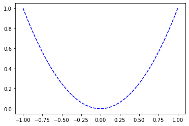
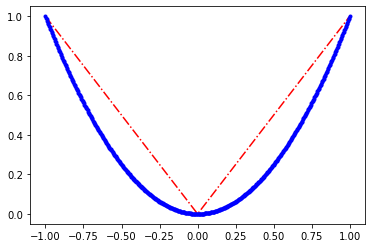
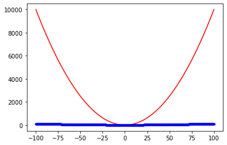
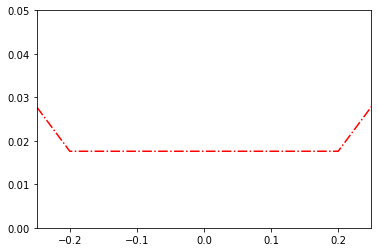
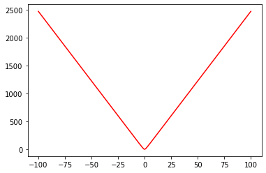
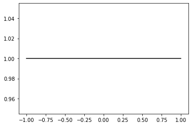
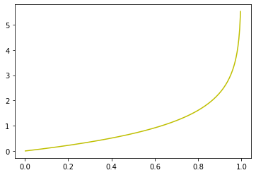
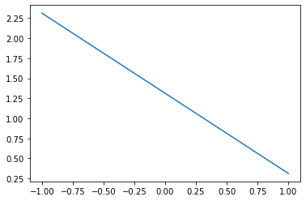

Implementing Loss Functions
===========================

.. code:: ipython3

    import matplotlib.pyplot as plt
    import tensorflow.compat.v1 as tf

.. code:: ipython3

    tf.disable_eager_execution()
    tf.disable_v2_behavior()

.. parsed-literal::

    WARNING:tensorflow:From /opt/anaconda3/lib/python3.8/site-packages/tensorflow/python/compat/v2_compat.py:111: disable_resource_variables (from tensorflow.python.ops.variable_scope) is deprecated and will be removed in a future version.
    Instructions for updating:
    non-resource variables are not supported in the long term

.. code:: ipython3

    sess = tf.Session()

.. code:: ipython3

    # The loss function gives a numerical distance between the two
    # regression: predicting a continuous dependent variable.
    # L2 norm loss function is a great loss function because it becomes very curved
    # near the target. And, the closer it gets, the more slowly it converge to the target

.. code:: ipython3

    x_vals = tf.linspace(-1., 1., 500)
    x_array = sess.run(x_vals)
    target = tf.constant(0.)

L2 norm loss function
---------------------

.. code:: ipython3

    l2_y_vals = tf.square(target-x_vals)
    l2_y_out = sess.run(l2_y_vals)

.. code:: ipython3

    plt.plot(x_array, l2_y_out, 'b--', label = 'L2 Loss')

.. parsed-literal::

    [<matplotlib.lines.Line2D at 0x7fdf74c019d0>]

.. code:: ipython3

    # L2 Neural Network Loss Function

.. code:: ipython3

    l2_y_out = sess.run(tf.nn.l2_loss(target-x_vals))
    #plt.plot(x_array, l2_y_out, 'r-.', label = 'L2 NN Norm Loss')

.. code:: ipython3

    l2_y_out

.. parsed-literal::

    83.667336

.. code:: ipython3

    (target-x_vals).shape

.. parsed-literal::

    TensorShape([Dimension(500)])

L1 norm loss function
---------------------

.. code:: ipython3

    l1_y_vals = tf.abs(target-x_vals)
    l1_y_out = sess.run(l1_y_vals)
    plt.plot(x_array, l1_y_out, 'r-.', label = 'L1 norm')
    plt.plot(x_array, l2_y_out, 'b.-', label = 'L2 norm')

.. parsed-literal::

    [<matplotlib.lines.Line2D at 0x7fdf75bb4370>]

.. code:: ipython3

    x_vals = tf.lin_space(-100., 100., 500)
    x_array = sess.run(x_vals)
    l2_y_vals = tf.square(x_array-target)
    l2_y_out = sess.run(l2_y_vals)
    l1_y_vals = tf.abs(x_array-target)
    l1_y_out = sess.run(l1_y_vals)
    plt.plot(x_array,l2_y_out, 'r-', label= 'L2 norm')
    plt.plot(x_array, l1_y_out, 'b.-', label = 'L1 norm')

.. parsed-literal::

    [<matplotlib.lines.Line2D at 0x7fdf76d2ac40>]

.. code:: ipython3

    # As you can see from the figure above, the L1 norm loss function 
    # is less steep than L2 norm loss function. Therefore, L1 norm is
    # better for outliers than L2 norm. But the L1 norm loss function is
    # more sharper than L2 norm function.

Pesudo-Hubber Loss Function
---------------------------

.. code:: ipython3

    # Pesudo-Hubber loss function takes advantages of both L1 norm loss 
    # function and L2 norm loss function. being convex near the 

.. code:: ipython3

    delta1 = tf.constant(0.25)
    phuber1_y_vals = tf.multiply(tf.square(delta1), tf.sqrt(1.+tf.square((target-x_vals)/delta1))-1.)
    phuber1_y_out = sess.run(phuber1_y_vals)
    plt.plot(x_array, phuber1_y_out, 'r-.')
    plt.ylim(0,0.05)
    plt.xlim(-0.25,0.25)

.. parsed-literal::

    (-0.25, 0.25)

.. code:: ipython3

    delta2 = tf.constant(5.)
    phuber2_y_vals = tf.multiply(tf.square(delta2), tf.sqrt(1.+tf.square((target-x_vals)))-1.)
    phuber2_y_out = sess.run(phuber2_y_vals)
    plt.plot(x_array, phuber2_y_out, 'r-')
    #plt.ylim(0, 10)
    #plt.xlim(3, 7)

.. parsed-literal::

    [<matplotlib.lines.Line2D at 0x7fdf586e2670>]

.. code:: ipython3

    # Hinge loss is mostly used for support vector machines
    # but can be used in neural networks as well. It is meant
    # compute a loss between the two target classes, 1 and -1. 
    # In the following code, we are using the target values, so
    # so the closer our predictions are near to 1, the lower the 
    # loss value.

.. code:: ipython3

    x_vals = tf.lin_space(-1., 1., 500)
    x_array = sess.run(x_vals)
    hinge_y_vals = tf.maximum(0., 1.- tf.multiply(target, x_vals))
    hinge_y_out = sess.run(hinge_y_vals)

.. code:: ipython3

    plt.plot(x_array, hinge_y_out, 'k-')

.. parsed-literal::

    [<matplotlib.lines.Line2D at 0x7fdf58b77c10>]

.. code:: ipython3

    # Cross-Entropy Loss
    xentropy_y_vals = -tf.multiply(target, tf.log(x_vals))-tf.multiply((1.-target), tf.log(1.-x_vals))
    xentropy_y_out = sess.run(xentropy_y_vals)
    plt.plot(x_array, xentropy_y_out, 'y-')

.. parsed-literal::

    [<matplotlib.lines.Line2D at 0x7fdf58db87c0>]

.. code:: ipython3

    # Sigmoid Cross Entropy Loss
    targets = tf.fill([500,],1.)
    xentropy_sigmoid_y_vals = tf.nn.sigmoid_cross_entropy_with_logits(labels=x_vals, logits=targets)
    xentropy_sigmoid_y_out = sess.run(xentropy_sigmoid_y_vals)

.. code:: ipython3

    plt.plot(x_array,xentropy_sigmoid_y_out)

.. parsed-literal::

    [<matplotlib.lines.Line2D at 0x7fdf58ead1f0>]

