.. code:: python

    import tensorflow.compat.v1 as tf
    import numpy as np
    import matplotlib.pyplot as plt
    from sklearn.datasets import load_iris
    tf.disable_v2_behavior()
    tf.disable_eager_execution()
    sess = tf.Session()

.. parsed-literal::

    /opt/anaconda3/lib/python3.8/site-packages/requests/__init__.py:89: RequestsDependencyWarning: urllib3 (1.26.8) or chardet (3.0.4) doesn't match a supported version!
      warnings.warn("urllib3 ({}) or chardet ({}) doesn't match a supported "

.. parsed-literal::

    WARNING:tensorflow:From /opt/anaconda3/lib/python3.8/site-packages/tensorflow/python/compat/v2_compat.py:111: disable_resource_variables (from tensorflow.python.ops.variable_scope) is deprecated and will be removed in a future version.
    Instructions for updating:
    non-resource variables are not supported in the long term

loading datasets
================

.. code:: python

    iris = load_iris()

Turn Setosa in targets into 1 while non-setosa into 0
=====================================================

.. code:: python

    iris_target = np.array([1. if x==0 else 0. for x in iris.target])

Get petal width and petal length
================================

.. code:: python

    iris_2d = np.array([[x[2], x[3]] for x in iris.data])

Training Settings
=================

.. code:: python

    batch_size = 20 # choose the right size of training batch. The larger the batch is, 
    # the more time-consuming the single loop trainning is.
    # Feeding dictionary: rand_x_1, rand_x_2, y_target
    rand_x_1 = tf.placeholder(shape=[None, 1], dtype=tf.float32) # feed dictionary
    rand_x_2 = tf.placeholder(shape=[None,1], dtype=tf.float32)  # feed dictionary
    y_target = tf.placeholder(shape=[None,1], dtype=tf.float32)  # feed dictionary
    A = tf.Variable(tf.random_normal(shape=[1,1]))
    b = tf.Variable(tf.random_normal(shape=[1,1]))
    my_mult = tf.multiply(A, rand_x_2)
    my_add = tf.add(my_mult, b)
    my_output = tf.subtract(rand_x_1, my_add)
    xentropy = tf.nn.sigmoid_cross_entropy_with_logits(logits=my_output, labels=y_target)
    my_opt = tf.train.GradientDescentOptimizer(0.05)
    train_step = my_opt.minimize(xentropy)

Start Training
==============

.. code:: python

    C = []
    B = []
    a = []
    for i in range(1000):
        rand_indices = np.random.choice(150, size=batch_size)
        rand_x1 = np.array([[x[0]] for x in iris_2d[rand_indices]])
        rand_x2 = np.array([[x[1]] for x in iris_2d[rand_indices]])
        rand_y1 = np.array([[x] for x in iris_target[rand_indices]])
        sess.run(train_step, feed_dict={rand_x_1: rand_x1, rand_x_2: rand_x2, y_target: rand_y1})
        C.append(i)
        B.append(float(sess.run(b)))
        a.append(float(sess.run(A)))
        if (i+1)%200 == 0:
            print(83*"-")
            print("Train Step #" + str(i+1) + "\n")
            print("A = " + str(sess.run(A)) + "; b = " + str(sess.run(b)))       

.. parsed-literal::

    -----------------------------------------------------------------------------------
    Train Step #200
    
    A = [[18.12088]]; b = [[-10.885672]]
    -----------------------------------------------------------------------------------
    Train Step #400
    
    A = [[18.193594]]; b = [[-10.990616]]
    -----------------------------------------------------------------------------------
    Train Step #600
    
    A = [[18.305798]]; b = [[-11.029556]]
    -----------------------------------------------------------------------------------
    Train Step #800
    
    A = [[18.413456]]; b = [[-11.058271]]
    -----------------------------------------------------------------------------------
    Train Step #1000
    
    A = [[18.52922]]; b = [[-11.061981]]

.. code:: python

    rand_x1 # Array Type shape=[None, 1]

.. parsed-literal::

    array([[1.5],
           [1.5],
           [4.3],
           [4.7],
           [4.1],
           [1.4],
           [5.6],
           [1.6],
           [1.7],
           [1.7],
           [4. ],
           [6.7],
           [1.4],
           [5.1],
           [1.6],
           [6.7],
           [3.3],
           [1.6],
           [4.9],
           [4.4]])

.. code:: python

    plt.plot(C, B)

.. parsed-literal::

    [<matplotlib.lines.Line2D at 0x7f7960f6c490>]

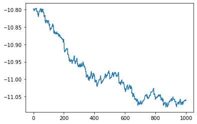

.. code:: python

    plt.plot(C,a)

.. parsed-literal::

    [<matplotlib.lines.Line2D at 0x7f7980e88cd0>]

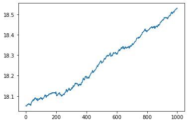

.. code:: python

    [[slope]] = sess.run(A)
    [[intercept]] = sess.run(b)
    x = np.linspace(0,3,num=50)
    ablineValues = []
    for i in x:
        ablineValues.append(slope*i+intercept)
    setosa_x = [a[1] for i, a in enumerate(iris_2d) if iris_target[i] ==1]
    setosa_y = [a[0] for i, a in enumerate(iris_2d) if iris_target[i] ==1]
    non_setosa_x = [a[1] for i, a in enumerate(iris_2d) if iris_target[i] ==0]
    non_setosa_y = [a[0] for i, a in enumerate(iris_2d) if iris_target[i] ==0]
    plt.plot(setosa_x, setosa_y, 'rx', ms=10, mew=2, label="setosa")
    plt.plot(non_setosa_x, non_setosa_y, 'bo',label="Non-setosa")
    plt.plot(x, ablineValues, 'b-')
    plt.xlim([0.0, 2.7])
    plt.ylim([0.0, 7.1])
    plt.suptitle("Linear separator for I.setosa", fontsize=20)
    plt.xlabel("Petal Length")
    plt.ylabel("Petal Width")
    plt.legend(loc="lower right")
    plt.show()

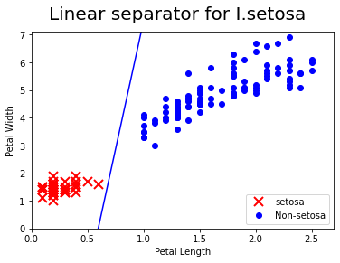

.. code:: python

    # Weighted cross entropy is weighted version of the sigmoid cross entropy loss. We provide a weight on the positive target. 
    # We provided a weight on the positive target. For an example, we will weight the target by 0.5, as follows:
    batch_size = 20 # choose the right size of training batch. The larger the batch is, 
    # the more time-consuming the single loop trainning is.
    # Feeding dictionary: rand_x_1, rand_x_2, y_target
    rand_x_1 = tf.placeholder(shape=[None, 1], dtype=tf.float32) # feed dictionary
    rand_x_2 = tf.placeholder(shape=[None,1], dtype=tf.float32)  # feed dictionary
    y_target = tf.placeholder(shape=[None,1], dtype=tf.float32)  # feed dictionary
    A = tf.Variable(tf.random_normal(shape=[1,1]))
    b = tf.Variable(tf.random_normal(shape=[1,1]))
    my_mult = tf.multiply(A, rand_x_2)
    my_add = tf.add(my_mult, b)
    my_output = tf.subtract(rand_x_1, my_add)
    weight = tf.constant(0.8)
    xentropy_weighted_y_vals = tf.nn.weighted_cross_entropy_with_logits(logits=my_output, labels=y_target, pos_weight=weight)
    train_step = my_opt.minimize(xentropy_weighted_y_vals)

.. code:: python

    init = tf.initialize_all_variables()
    sess.run(init)

.. code:: python

    C = []
    B = []
    a = []
    for i in range(1000):
        rand_indices = np.random.choice(150, size=batch_size)
        rand_x1 = np.array([[x[0]] for x in iris_2d[rand_indices]])
        rand_x2 = np.array([[x[1]] for x in iris_2d[rand_indices]])
        rand_y1 = np.array([[x] for x in iris_target[rand_indices]])
        sess.run(train_step, feed_dict={rand_x_1: rand_x1, rand_x_2: rand_x2, y_target: rand_y1})
        C.append(i)
        B.append(float(sess.run(b)))
        a.append(float(sess.run(A)))
        if (i+1)%200 == 0:
            print(83*"-")
            print("Train Step #" + str(i+1) + "\n")
            print("A = " + str(sess.run(A)) + "; b = " + str(sess.run(b)))   

.. parsed-literal::

    -----------------------------------------------------------------------------------
    Train Step #200
    
    A = [[8.408454]]; b = [[-3.2687926]]
    -----------------------------------------------------------------------------------
    Train Step #400
    
    A = [[9.934499]]; b = [[-4.3847203]]
    -----------------------------------------------------------------------------------
    Train Step #600
    
    A = [[10.847868]]; b = [[-5.1551175]]
    -----------------------------------------------------------------------------------
    Train Step #800
    
    A = [[11.583517]]; b = [[-5.6893206]]
    -----------------------------------------------------------------------------------
    Train Step #1000
    
    A = [[12.1639385]]; b = [[-6.1393924]]

.. code:: python

    plt.plot(C,B)
    plt.plot(C,a)

.. parsed-literal::

    [<matplotlib.lines.Line2D at 0x7f79613b20d0>]

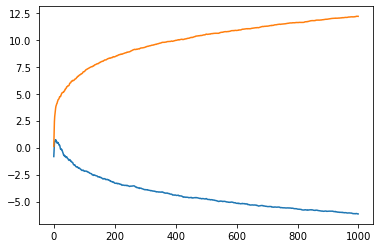

.. code:: python

    [[slope]] = sess.run(A)
    [[intercept]] = sess.run(b)
    x = np.linspace(0,3,num=50)
    ablineValues = []
    for i in x:
        ablineValues.append(slope*i+intercept)
    setosa_x = [a[1] for i, a in enumerate(iris_2d) if iris_target[i] ==1]
    setosa_y = [a[0] for i, a in enumerate(iris_2d) if iris_target[i] ==1]
    non_setosa_x = [a[1] for i, a in enumerate(iris_2d) if iris_target[i] ==0]
    non_setosa_y = [a[0] for i, a in enumerate(iris_2d) if iris_target[i] ==0]
    plt.plot(setosa_x, setosa_y, 'rx', ms=10, mew=2, label="setosa")
    plt.plot(non_setosa_x, non_setosa_y, 'bo',label="Non-setosa")
    plt.plot(x, ablineValues, 'b-')
    plt.xlim([0.0, 2.7])
    plt.ylim([0.0, 7.1])
    plt.suptitle("Linear separator for I.setosa", fontsize=20)
    plt.xlabel("Petal Length")
    plt.ylabel("Petal Width")
    plt.legend(loc="lower right")
    plt.show()

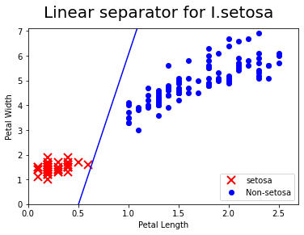

Not applicable for Cross-entropy for this kind loss function is designed to measure the actual class 0, 1
=========================================================================================================

.. code:: python

    # Cross-entropy loss for a binary case is sometimes referred
    # to as the logistic loss function
    batch_size = 20 # choose the right size of training batch. The larger the batch is, 
    # the more time-consuming the single loop trainning is.
    # Feeding dictionary: rand_x_1, rand_x_2, y_target
    rand_x_1 = tf.placeholder(shape=[None, 1], dtype=tf.float32) # feed dictionary
    rand_x_2 = tf.placeholder(shape=[None,1], dtype=tf.float32)  # feed dictionary
    y_target = tf.placeholder(shape=[None,1], dtype=tf.float32)  # feed dictionary
    A = tf.Variable(tf.random_normal(shape=[1,1]))
    b = tf.Variable(tf.random_normal(shape=[1,1]))
    my_mult = tf.multiply(A, rand_x_2)
    my_add = tf.add(my_mult, b)
    my_output = tf.subtract(rand_x_1, my_add)
    sparse_xentropy = -tf.multiply(y_target, tf.log(my_output))-tf.multiply((1.-y_target),tf.log(1.-my_output))
    train_step = my_opt.minimize(sparse_xentropy)
    init = tf.initialize_all_variables()
    sess.run(init)

.. code:: python

    C = []
    B = []
    a = []
    for i in range(1000):
        rand_indices = np.random.choice(150, size=batch_size)
        rand_x1 = np.array([[x[0]] for x in iris_2d[rand_indices]])
        rand_x2 = np.array([[x[1]] for x in iris_2d[rand_indices]])
        rand_y1 = np.array([[x] for x in iris_target[rand_indices]])
        sess.run(train_step, feed_dict={rand_x_1: rand_x1, rand_x_2: rand_x2, y_target: rand_y1})
        C.append(i)
        B.append(float(sess.run(b)))
        a.append(float(sess.run(A)))
        if (i+1)%200 == 0:
            print(83*"-")
            print("Training Step #" + str(i+1) + "\n")
            print("A = " + str(sess.run(A)) + "; b = " + str(sess.run(b)))   

.. parsed-literal::

    -----------------------------------------------------------------------------------
    Training Step #200
    
    A = [[-32.213852]]; b = [[-34.43366]]
    -----------------------------------------------------------------------------------
    Training Step #400
    
    A = [[-34.841114]]; b = [[-37.343002]]
    -----------------------------------------------------------------------------------
    Training Step #600
    
    A = [[-37.28997]]; b = [[-40.04912]]
    -----------------------------------------------------------------------------------
    Training Step #800
    
    A = [[-39.589073]]; b = [[-42.59206]]
    -----------------------------------------------------------------------------------
    Training Step #1000
    
    A = [[-41.781662]]; b = [[-44.980614]]

.. code:: python

    plt.plot(C,a)
    plt.plot(C,B)

.. parsed-literal::

    [<matplotlib.lines.Line2D at 0x7f7962653070>]

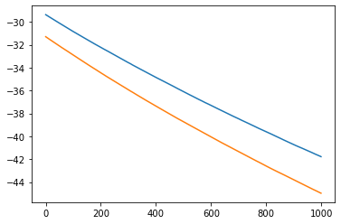

.. code:: python

    [[slope]] = sess.run(A)
    [[intercept]] = sess.run(b)
    x = np.linspace(0,3,num=50)
    ablineValues = []
    for i in x:
        ablineValues.append(slope*i+intercept)
    setosa_x = [a[1] for i, a in enumerate(iris_2d) if iris_target[i] ==1]
    setosa_y = [a[0] for i, a in enumerate(iris_2d) if iris_target[i] ==1]
    non_setosa_x = [a[1] for i, a in enumerate(iris_2d) if iris_target[i] ==0]
    non_setosa_y = [a[0] for i, a in enumerate(iris_2d) if iris_target[i] ==0]
    plt.plot(setosa_x, setosa_y, 'rx', ms=10, mew=2, label="setosa")
    plt.plot(non_setosa_x, non_setosa_y, 'bo',label="Non-setosa")
    plt.plot(x, ablineValues, 'b-')
    plt.xlim([0.0, 2.7])
    plt.ylim([0.0, 7.1])
    plt.suptitle("Linear separator for I.setosa", fontsize=20)
    plt.xlabel("Petal Length")
    plt.ylabel("Petal Width")
    plt.legend(loc="lower right")
    plt.show()

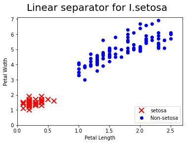

.. code:: python

    # refined the iris target
    iris_target = np.array([1. if x==0 else -1. for x in iris.target])

.. code:: python

    # Hinge loss function for -1 and 1 classification. Hinge loss fucntion is mostly used in support vector machine but can be used
    # in neural network as well
    batch_size = 20 # choose the right size of training batch. The larger the batch is, 
    # the more time-consuming the single loop trainning is.
    # Feeding dictionary: rand_x_1, rand_x_2, y_target
    rand_x_1 = tf.placeholder(shape=[None, 1], dtype=tf.float32) # feed dictionary
    rand_x_2 = tf.placeholder(shape=[None,1], dtype=tf.float32)  # feed dictionary
    y_target = tf.placeholder(shape=[None,1], dtype=tf.float32)  # feed dictionary
    A = tf.Variable(tf.random_normal(shape=[1,1]))
    b = tf.Variable(tf.random_normal(shape=[1,1]))
    my_mult = tf.multiply(A, rand_x_2)
    my_add = tf.add(my_mult, b)
    my_output = tf.subtract(rand_x_1, my_add)
    hinge_loss = tf.maximum(0., 1.-tf.multiply(y_target, my_output))
    train_step = my_opt.minimize(hinge_loss)
    init = tf.initialize_all_variables()
    sess.run(init)

.. code:: python

    C = []
    B = []
    a = []
    for i in range(1000):
        rand_indices = np.random.choice(150, size=batch_size)
        rand_x1 = np.array([[x[0]] for x in iris_2d[rand_indices]])
        rand_x2 = np.array([[x[1]] for x in iris_2d[rand_indices]])
        rand_y1 = np.array([[x] for x in iris_target[rand_indices]])
        sess.run(train_step, feed_dict={rand_x_1: rand_x1, rand_x_2: rand_x2, y_target: rand_y1})
        C.append(i)
        B.append(float(sess.run(b)))
        a.append(float(sess.run(A)))
        if (i+1)%200 == 0:
            print(83*"-")
            print("Training Step #" + str(i+1) + "\n")
            print("A = " + str(sess.run(A)) + "; b = " + str(sess.run(b)))   

.. parsed-literal::

    -----------------------------------------------------------------------------------
    Training Step #200
    
    A = [[7.349649]]; b = [[-2.6604133]]
    -----------------------------------------------------------------------------------
    Training Step #400
    
    A = [[8.284655]]; b = [[-3.2604127]]
    -----------------------------------------------------------------------------------
    Training Step #600
    
    A = [[8.7696705]]; b = [[-3.7604122]]
    -----------------------------------------------------------------------------------
    Training Step #800
    
    A = [[8.944676]]; b = [[-3.910412]]
    -----------------------------------------------------------------------------------
    Training Step #1000
    
    A = [[9.194684]]; b = [[-4.060413]]

.. code:: python

    [[slope]] = sess.run(A)
    [[intercept]] = sess.run(b)
    x = np.linspace(0,3,num=50)
    ablineValues = []
    for i in x:
        ablineValues.append(slope*i+intercept)
    setosa_x = [a[1] for i, a in enumerate(iris_2d) if iris_target[i] ==1]
    setosa_y = [a[0] for i, a in enumerate(iris_2d) if iris_target[i] ==1]
    non_setosa_x = [a[1] for i, a in enumerate(iris_2d) if iris_target[i] ==-1]
    non_setosa_y = [a[0] for i, a in enumerate(iris_2d) if iris_target[i] ==-1]
    plt.plot(setosa_x, setosa_y, 'rx', ms=10, mew=2, label="setosa")
    plt.plot(non_setosa_x, non_setosa_y, 'bo',label="Non-setosa")
    plt.plot(x, ablineValues, 'b-')
    plt.xlim([0.0, 2.7])
    plt.ylim([0.0, 7.1])
    plt.suptitle("Linear separator for I.setosa", fontsize=20)
    plt.xlabel("Petal Length")
    plt.ylabel("Petal Width")
    plt.legend(loc="lower right")
    plt.show()

.. code:: python

    plt.plot(C,B)
    plt.plot(C,a)

.. parsed-literal::

    [<matplotlib.lines.Line2D at 0x7f79626269d0>]

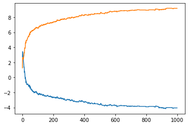

.. code:: python

    # 
    iris_2d = np.array([[x[0], x[3]] for x in iris.data])

.. code:: python

    batch_size = 20 # choose the right size of training batch. The larger the batch is, 
    # the more time-consuming the single loop trainning is.
    # Feeding dictionary: rand_x_1, rand_x_2, y_target
    rand_x_1 = tf.placeholder(shape=[None, 1], dtype=tf.float32) # feed dictionary
    rand_x_2 = tf.placeholder(shape=[None,1], dtype=tf.float32)  # feed dictionary
    y_target = tf.placeholder(shape=[None,1], dtype=tf.float32)  # feed dictionary
    A = tf.Variable(tf.random_normal(shape=[1,1]))
    b = tf.Variable(tf.random_normal(shape=[1,1]))
    my_mult = tf.multiply(A, rand_x_2)
    my_add = tf.add(my_mult, b)
    my_output = tf.subtract(rand_x_1, my_add)
    xentropy = tf.nn.sigmoid_cross_entropy_with_logits(logits=my_output, labels=y_target)
    my_opt = tf.train.GradientDescentOptimizer(0.05)
    train_step = my_opt.minimize(xentropy)
    init = tf.initialize_all_variables()
    sess.run(init)

.. code:: python

    C = []
    B = []
    a = []
    for i in range(1000):
        rand_indices = np.random.choice(150, size=batch_size)
        rand_x1 = np.array([[x[0]] for x in iris_2d[rand_indices]])
        rand_x2 = np.array([[x[1]] for x in iris_2d[rand_indices]])
        rand_y1 = np.array([[x] for x in iris_target[rand_indices]])
        sess.run(train_step, feed_dict={rand_x_1: rand_x1, rand_x_2: rand_x2, y_target: rand_y1})
        C.append(i)
        B.append(float(sess.run(b)))
        a.append(float(sess.run(A)))
        if (i+1)%200 == 0:
            print(83*"-")
            print("Train Step #" + str(i+1) + "\n")
            print("A = " + str(sess.run(A)) + "; b = " + str(sess.run(b)))       

.. parsed-literal::

    -----------------------------------------------------------------------------------
    Train Step #200
    
    A = [[1243.5819]]; b = [[399.3704]]
    -----------------------------------------------------------------------------------
    Train Step #400
    
    A = [[1450.4576]]; b = [[464.17035]]
    -----------------------------------------------------------------------------------
    Train Step #600
    
    A = [[1655.5627]]; b = [[529.37006]]
    -----------------------------------------------------------------------------------
    Train Step #800
    
    A = [[1865.1127]]; b = [[595.9702]]
    -----------------------------------------------------------------------------------
    Train Step #1000
    
    A = [[2066.7285]]; b = [[657.5702]]

.. code:: python

    [[slope]] = sess.run(A)
    [[intercept]] = sess.run(b)
    x = np.linspace(0,3,num=50)
    ablineValues = []
    for i in x:
        ablineValues.append(slope*i+intercept)
    setosa_x = [a[1] for i, a in enumerate(iris_2d) if iris_target[i] ==1]
    setosa_y = [a[0] for i, a in enumerate(iris_2d) if iris_target[i] ==1]
    non_setosa_x = [a[1] for i, a in enumerate(iris_2d) if iris_target[i] ==-1]
    non_setosa_y = [a[0] for i, a in enumerate(iris_2d) if iris_target[i] ==-1]
    plt.plot(setosa_x, setosa_y, 'rx', ms=10, mew=2, label="setosa")
    plt.plot(non_setosa_x, non_setosa_y, 'bo',label="Non-setosa")
    plt.plot(x, ablineValues, 'b-')
    plt.suptitle("Linear separator for I.setosa", fontsize=20)
    plt.xlabel("Petal Length")
    plt.ylabel("Petal Width")
    plt.legend(loc="lower right")
    plt.show()

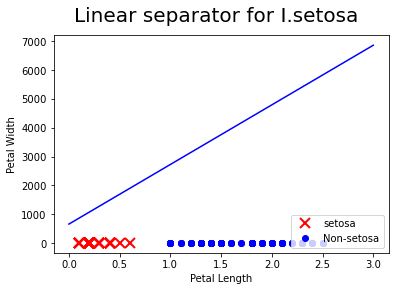

.. code:: python

    import matplotlib.pyplot as plt
    import numpy as np
    import tensorflow.compat.v1 as tf
    sess = tf.Session()
    x_vals = np.random.normal(1.,0.1, 100)
    y_vals = np.repeat(10., 100)
    x_data = tf.placeholder(shape=[None,1], dtype=tf.float32)
    y_target = tf.placeholder(shape=[None,1],dtype=tf.float32)
    batch_size = 25
    train_indices = np.random.choice(len(x_vals), round(len(x_vals)*0.8),replace=False)
    test_indices = np.array(list(set(range(len(x_vals)))-set(train_indices)))
    
    x_vals_train = x_vals[train_indices]
    x_vals_test = x_vals[test_indices]
    y_vals_train = y_vals[train_indices]
    y_vals_test = y_vals[test_indices]
    A = tf.Variable(tf.random.normal(shape=[1,1]))

.. code:: python

    my_output = tf.matmul(x_data, A)
    loss = tf.reduce_mean(tf.square(my_output-y_target))
    init = tf.initialize_all_variables()
    sess.run(init)
    my_opt = tf.train.GradientDescentOptimizer(0.02)
    train_step = my_opt.minimize(loss)

.. code:: python

    for i in range(100):
        rand_index = np.random.choice(len(x_vals_train), size = batch_size)
        rand_x = np.transpose([x_vals_train[rand_index]])
        rand_y = np.transpose([y_vals_train[rand_index]])
        sess.run(train_step, feed_dict={x_data: rand_x, y_target: rand_y})
        if (i+1)%25 ==0:
            print("step A: " + str(sess.run(A)))

.. parsed-literal::

    step A: [[6.1282105]]
    step A: [[8.543949]]
    step A: [[9.427389]]
    step A: [[9.795633]]

.. code:: python

    batch_size = 25
    x_vals = np.concatenate((np.random.normal(-1, 1, 100), np.random.normal(2,1,100)))
    y_vals = np.concatenate((np.repeat(0.,100), np.repeat(1., 100)))
    x_data = tf.placeholder(shape=[1,None], dtype=tf.float32)
    y_target = tf.placeholder(shape=[1,None], dtype=tf.float32)
    train_indices = np.random.choice(len(x_vals), round(len(x_vals)*0.8), replace=False)
    test_indices = np.array(list(set(range(len(x_vals)))-set(train_indices)))
    x_vals_train = x_vals[train_indices]
    x_vals_test = x_vals[test_indices]
    y_vals_train = y_vals[train_indices]
    y_vals_test = y_vals[test_indices]
    A = tf.Variable(tf.random_normal(mean=10, shape=[1]))
    
    my_output = tf.add(x_data, A)
    init = tf.initialize_all_variables()
    sess.run(init)
    C = []
    B = []
    D = []
    xentropy = tf.reduce_mean(tf.nn.sigmoid_cross_entropy_with_logits(logits=my_output, labels=y_target))
    my_opt = tf.train.GradientDescentOptimizer(0.05)
    train_step = my_opt.minimize(xentropy)
    for i in range(4000):
        rand_index = np.random.choice(len(x_vals_train), size = batch_size)
        rand_x = [x_vals_train[rand_index]]
        rand_y = [y_vals_train[rand_index]]
        sess.run(train_step, feed_dict={x_data: rand_x, y_target: rand_y})
        C.append(i)
        B.append(sess.run(A))
        D.append(sess.run(xentropy, feed_dict={x_data: rand_x, y_target: rand_y}))
        if (i+1)%200 == 0:
            print("Step #" + str(i+1) + " A = " + str(sess.run(A)))
            print("Loss = " + str(sess.run(xentropy, feed_dict={x_data: rand_x, y_target: rand_y})))

.. parsed-literal::

    Step #200 A = [4.4231954]
    Loss = 2.0177038
    Step #400 A = [0.8580134]
    Loss = 0.38587436
    Step #600 A = [-0.20734093]
    Loss = 0.2290817
    Step #800 A = [-0.4499189]
    Loss = 0.30788526
    Step #1000 A = [-0.5537585]
    Loss = 0.2411242
    Step #1200 A = [-0.5834869]
    Loss = 0.21759026
    Step #1400 A = [-0.5452181]
    Loss = 0.3135532
    Step #1600 A = [-0.5148223]
    Loss = 0.3241151
    Step #1800 A = [-0.5066403]
    Loss = 0.23580647
    Step #2000 A = [-0.5372685]
    Loss = 0.32416114
    Step #2200 A = [-0.55678415]
    Loss = 0.20359325
    Step #2400 A = [-0.53384054]
    Loss = 0.4179452
    Step #2600 A = [-0.55560905]
    Loss = 0.3174747
    Step #2800 A = [-0.55784374]
    Loss = 0.4003071
    Step #3000 A = [-0.5510922]
    Loss = 0.24280085
    Step #3200 A = [-0.5364746]
    Loss = 0.22302383
    Step #3400 A = [-0.5466024]
    Loss = 0.32935375
    Step #3600 A = [-0.55610454]
    Loss = 0.2350246
    Step #3800 A = [-0.5904466]
    Loss = 0.3662425
    Step #4000 A = [-0.5405973]
    Loss = 0.4017843

.. code:: python

    plt.plot(C, B, label="A value")
    plt.plot(C,D,label="loss function")
    plt.show()

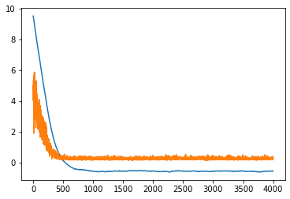

.. code:: python

    y_prediction = tf.squeeze(tf.round(tf.nn.sigmoid(tf.add(x_data, A))))
    correct_prediction = tf.equal(y_prediction,y_target)
    accuracy = tf.reduce_mean(tf.cast(correct_prediction, tf.float32))
    acc_value_test = sess.run(accuracy, feed_dict={x_data: [x_vals_test], y_target: [y_vals_test]})
    acc_value_train = sess.run(accuracy, feed_dict = {x_data: [x_vals_train], y_target: [y_vals_train]})
    print("Accuracy on train set: " + str(acc_value_train))
    print("Accuracy on test set: " + str(acc_value_test))

.. parsed-literal::

    Accuracy on train set: 0.95
    Accuracy on test set: 0.95

.. code:: python

    A_result = sess.run(A)
    bins = np.linspace(-5,5,50)
    plt.hist(x_vals[0:100],bins, alpha=0.5, label="N(-1,1)", color="blue")
    plt.hist(x_vals[100:200],bins[0:100], alpha=0.5, label="N(2,1)", color="red")
    plt.plot((A_result, A_result), (0, 8), "k--", linewidth=3, label="A =" + str(np.round(A_result,2)))
    plt.legend(loc="upper right")
    plt.title("Binary Classifier, Accuracy=" +str(np.round(acc_value_test,2)))
    plt.show()

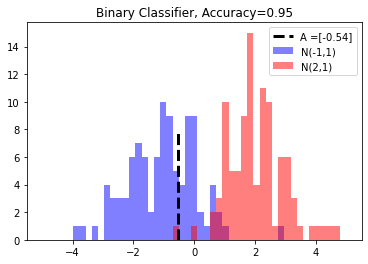

