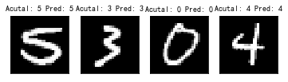

Model Evaluation
---------------------

.. code:: python

    import random
    import tensorflow as tf
    import matplotlib.pyplot as plt
    import sklearn
    import numpy as np
    from PIL import Image
    from tensorflow.examples.tutorials.mnist import input_data

.. parsed-literal::

    /home/ma-user/anaconda3/envs/TensorFlow-1.13.1/lib/python3.6/site-packages/tensorflow/python/framework/dtypes.py:526: FutureWarning: Passing (type, 1) or '1type' as a synonym of type is deprecated; in a future version of numpy, it will be understood as (type, (1,)) / '(1,)type'.
      _np_qint8 = np.dtype([("qint8", np.int8, 1)])
    /home/ma-user/anaconda3/envs/TensorFlow-1.13.1/lib/python3.6/site-packages/tensorflow/python/framework/dtypes.py:527: FutureWarning: Passing (type, 1) or '1type' as a synonym of type is deprecated; in a future version of numpy, it will be understood as (type, (1,)) / '(1,)type'.
      _np_quint8 = np.dtype([("quint8", np.uint8, 1)])
    /home/ma-user/anaconda3/envs/TensorFlow-1.13.1/lib/python3.6/site-packages/tensorflow/python/framework/dtypes.py:528: FutureWarning: Passing (type, 1) or '1type' as a synonym of type is deprecated; in a future version of numpy, it will be understood as (type, (1,)) / '(1,)type'.
      _np_qint16 = np.dtype([("qint16", np.int16, 1)])
    /home/ma-user/anaconda3/envs/TensorFlow-1.13.1/lib/python3.6/site-packages/tensorflow/python/framework/dtypes.py:529: FutureWarning: Passing (type, 1) or '1type' as a synonym of type is deprecated; in a future version of numpy, it will be understood as (type, (1,)) / '(1,)type'.
      _np_quint16 = np.dtype([("quint16", np.uint16, 1)])
    /home/ma-user/anaconda3/envs/TensorFlow-1.13.1/lib/python3.6/site-packages/tensorflow/python/framework/dtypes.py:530: FutureWarning: Passing (type, 1) or '1type' as a synonym of type is deprecated; in a future version of numpy, it will be understood as (type, (1,)) / '(1,)type'.
      _np_qint32 = np.dtype([("qint32", np.int32, 1)])
    /home/ma-user/anaconda3/envs/TensorFlow-1.13.1/lib/python3.6/site-packages/tensorflow/python/framework/dtypes.py:535: FutureWarning: Passing (type, 1) or '1type' as a synonym of type is deprecated; in a future version of numpy, it will be understood as (type, (1,)) / '(1,)type'.
      np_resource = np.dtype([("resource", np.ubyte, 1)])

.. code:: python

    sess = tf.Session()
    mnist = input_data.read_data_sets("MINST_data", one_hot=True)

.. parsed-literal::

    WARNING:tensorflow:From <ipython-input-2-7da412c0683a>:2: read_data_sets (from tensorflow.contrib.learn.python.learn.datasets.mnist) is deprecated and will be removed in a future version.
    Instructions for updating:
    Please use alternatives such as official/mnist/dataset.py from tensorflow/models.
    WARNING:tensorflow:From /home/ma-user/anaconda3/envs/TensorFlow-1.13.1/lib/python3.6/site-packages/tensorflow/contrib/learn/python/learn/datasets/mnist.py:260: maybe_download (from tensorflow.contrib.learn.python.learn.datasets.base) is deprecated and will be removed in a future version.
    Instructions for updating:
    Please write your own downloading logic.
    WARNING:tensorflow:From /home/ma-user/anaconda3/envs/TensorFlow-1.13.1/lib/python3.6/site-packages/tensorflow/contrib/learn/python/learn/datasets/mnist.py:262: extract_images (from tensorflow.contrib.learn.python.learn.datasets.mnist) is deprecated and will be removed in a future version.
    Instructions for updating:
    Please use tf.data to implement this functionality.
    Extracting MINST_data/train-images-idx3-ubyte.gz
    WARNING:tensorflow:From /home/ma-user/anaconda3/envs/TensorFlow-1.13.1/lib/python3.6/site-packages/tensorflow/contrib/learn/python/learn/datasets/mnist.py:267: extract_labels (from tensorflow.contrib.learn.python.learn.datasets.mnist) is deprecated and will be removed in a future version.
    Instructions for updating:
    Please use tf.data to implement this functionality.
    Extracting MINST_data/train-labels-idx1-ubyte.gz
    WARNING:tensorflow:From /home/ma-user/anaconda3/envs/TensorFlow-1.13.1/lib/python3.6/site-packages/tensorflow/contrib/learn/python/learn/datasets/mnist.py:110: dense_to_one_hot (from tensorflow.contrib.learn.python.learn.datasets.mnist) is deprecated and will be removed in a future version.
    Instructions for updating:
    Please use tf.one_hot on tensors.
    Extracting MINST_data/t10k-images-idx3-ubyte.gz
    Extracting MINST_data/t10k-labels-idx1-ubyte.gz
    WARNING:tensorflow:From /home/ma-user/anaconda3/envs/TensorFlow-1.13.1/lib/python3.6/site-packages/tensorflow/contrib/learn/python/learn/datasets/mnist.py:290: DataSet.__init__ (from tensorflow.contrib.learn.python.learn.datasets.mnist) is deprecated and will be removed in a future version.
    Instructions for updating:
    Please use alternatives such as official/mnist/dataset.py from tensorflow/models.

.. code:: python

    train_size = len(mnist.train.images)
    test_size = len(mnist.test.images)
    rand_train_indices = np.random.choice(len(mnist.train.images), train_size, replace=False)
    rand_test_indices = np.random.choice(len(mnist.test.images), test_size, replace=False)
    x_vals_train = mnist.train.images[rand_train_indices]
    x_vals_test = mnist.test.images[rand_test_indices]
    y_vals_train = mnist.train.labels[rand_train_indices]
    y_vals_test = mnist.test.labels[rand_test_indices]

.. code:: python

    k = 10
    batch_size = 6
    x_data_train = tf.placeholder(shape=[None,784], dtype=tf.float32)
    x_data_test = tf.placeholder(shape=[None,784], dtype=tf.float32)
    y_target_train = tf.placeholder(shape=[None,10],dtype=tf.float32)
    y_target_test = tf.placeholder(shape=[None, 10], dtype=tf.float32)
    distance = tf.reduce_sum(tf.abs(tf.subtract(x_data_train, tf.expand_dims(x_data_test, 1))),reduction_indices=2)

.. code:: python

    top_k_xvals, top_k_indices = tf.nn.top_k(tf.negative(distance),k=k)
    prediction_indices = tf.gather(y_target_train, top_k_indices)
    count_of_predictions = tf.reduce_sum(prediction_indices, reduction_indices=1)
    prediction = tf.argmax(count_of_predictions, dimension=1)

.. parsed-literal::

    WARNING:tensorflow:From <ipython-input-5-638de782a748>:4: calling argmax (from tensorflow.python.ops.math_ops) with dimension is deprecated and will be removed in a future version.
    Instructions for updating:
    Use the `axis` argument instead

.. code:: python

    num_loops = int(np.ceil(len(x_vals_test)/batch_size))
    test_output = []
    actual_vals = []
    for i in range(num_loops):
        min_index = i*batch_size
        max_index = min((i+1)*batch_size, len(x_vals_train))
        x_batch = x_vals_test[min_index:max_index]
        y_batch = y_vals_test[min_index: max_index]
        predictions = sess.run(prediction,feed_dict={x_data_train: x_vals_train, x_data_test: x_batch, y_target_train: y_vals_train, y_target_test: y_batch})
        test_output.extend(predictions)
        actual_vals.extend(np.argmax(y_batch, axis=1))

.. code:: python

    accuracy = sum([1./test_size for i in range(test_size) if test_output[i]==actual_vals[i]])
    print("Accuracy on test set: " + str(accuracy))

.. parsed-literal::

    Accuracy on test set: 0.9586999999999107

.. code:: python

    actuals = np.argmax(y_batch, axis=1)
    Nrows = 1
    Ncols = 4
    for i in range(len(actuals)):
        plt.subplot(Nrows, Ncols, i+1)
        plt.imshow(np.reshape(x_batch[i], [28,28]), cmap="Greys_r")
        plt.title("Acutal: " + str(actuals[i]) + " " + "Pred: " + str(predictions[i]), fontsize=10)
        frame = plt.gca()
        frame.axes.get_xaxis().set_visible(False)
        frame.axes.get_yaxis().set_visible(False)

