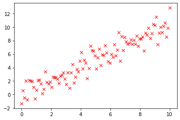

矩阵转置法
----------

.. code:: python

    import tensorflow.compat.v1 as tf
    tf.disable_eager_execution()
    tf.disable_v2_behavior()
    sess = tf.Session()

.. parsed-literal::

    /opt/anaconda3/lib/python3.8/site-packages/requests/__init__.py:89: RequestsDependencyWarning: urllib3 (1.26.8) or chardet (3.0.4) doesn't match a supported version!
      warnings.warn("urllib3 ({}) or chardet ({}) doesn't match a supported "

.. parsed-literal::

    WARNING:tensorflow:From /opt/anaconda3/lib/python3.8/site-packages/tensorflow/python/compat/v2_compat.py:111: disable_resource_variables (from tensorflow.python.ops.variable_scope) is deprecated and will be removed in a future version.
    Instructions for updating:
    non-resource variables are not supported in the long term

.. code:: python

    import matplotlib.pyplot as plt
    import numpy as np
    # numpy linspace (0, 0.01, 0.02,..., 1)
    x_vals = np.linspace(0, 10, 100)
    # floating numbers, fluctuation between x_vals
    y_vals = x_vals + np.random.normal(0, 1, 100)

.. code:: python

    plt.plot(x_vals, y_vals, 'rx')

.. parsed-literal::

    [<matplotlib.lines.Line2D at 0x7fc195a22400>]

.. code:: python

    # Change x_vals into matrix and then transpose it
    x_vals_transpose = np.transpose(np.matrix(x_vals))
    # Turn one hundred 1s into matrix and then transpose it
    ones_column = np.transpose(np.matrix(np.repeat(1, 100)))
    # Add the two previous matrix together
    A = np.column_stack((x_vals_transpose, ones_column))
    # change y_vals into matrix and then transpose it
    b = np.transpose(np.matrix(y_vals))

.. code:: python

    np.matrix.flatten(A)

.. parsed-literal::

    matrix([[ 0.        ,  1.        ,  0.1010101 ,  1.        ,  0.2020202 ,
              1.        ,  0.3030303 ,  1.        ,  0.4040404 ,  1.        ,
              0.50505051,  1.        ,  0.60606061,  1.        ,  0.70707071,
              1.        ,  0.80808081,  1.        ,  0.90909091,  1.        ,
              1.01010101,  1.        ,  1.11111111,  1.        ,  1.21212121,
              1.        ,  1.31313131,  1.        ,  1.41414141,  1.        ,
              1.51515152,  1.        ,  1.61616162,  1.        ,  1.71717172,
              1.        ,  1.81818182,  1.        ,  1.91919192,  1.        ,
              2.02020202,  1.        ,  2.12121212,  1.        ,  2.22222222,
              1.        ,  2.32323232,  1.        ,  2.42424242,  1.        ,
              2.52525253,  1.        ,  2.62626263,  1.        ,  2.72727273,
              1.        ,  2.82828283,  1.        ,  2.92929293,  1.        ,
              3.03030303,  1.        ,  3.13131313,  1.        ,  3.23232323,
              1.        ,  3.33333333,  1.        ,  3.43434343,  1.        ,
              3.53535354,  1.        ,  3.63636364,  1.        ,  3.73737374,
              1.        ,  3.83838384,  1.        ,  3.93939394,  1.        ,
              4.04040404,  1.        ,  4.14141414,  1.        ,  4.24242424,
              1.        ,  4.34343434,  1.        ,  4.44444444,  1.        ,
              4.54545455,  1.        ,  4.64646465,  1.        ,  4.74747475,
              1.        ,  4.84848485,  1.        ,  4.94949495,  1.        ,
              5.05050505,  1.        ,  5.15151515,  1.        ,  5.25252525,
              1.        ,  5.35353535,  1.        ,  5.45454545,  1.        ,
              5.55555556,  1.        ,  5.65656566,  1.        ,  5.75757576,
              1.        ,  5.85858586,  1.        ,  5.95959596,  1.        ,
              6.06060606,  1.        ,  6.16161616,  1.        ,  6.26262626,
              1.        ,  6.36363636,  1.        ,  6.46464646,  1.        ,
              6.56565657,  1.        ,  6.66666667,  1.        ,  6.76767677,
              1.        ,  6.86868687,  1.        ,  6.96969697,  1.        ,
              7.07070707,  1.        ,  7.17171717,  1.        ,  7.27272727,
              1.        ,  7.37373737,  1.        ,  7.47474747,  1.        ,
              7.57575758,  1.        ,  7.67676768,  1.        ,  7.77777778,
              1.        ,  7.87878788,  1.        ,  7.97979798,  1.        ,
              8.08080808,  1.        ,  8.18181818,  1.        ,  8.28282828,
              1.        ,  8.38383838,  1.        ,  8.48484848,  1.        ,
              8.58585859,  1.        ,  8.68686869,  1.        ,  8.78787879,
              1.        ,  8.88888889,  1.        ,  8.98989899,  1.        ,
              9.09090909,  1.        ,  9.19191919,  1.        ,  9.29292929,
              1.        ,  9.39393939,  1.        ,  9.49494949,  1.        ,
              9.5959596 ,  1.        ,  9.6969697 ,  1.        ,  9.7979798 ,
              1.        ,  9.8989899 ,  1.        , 10.        ,  1.        ]])

.. code:: python

    np.matrix.flatten(b)

.. parsed-literal::

    matrix([[-1.32657576,  0.56506495, -0.45773644,  2.05872291, -0.76011994,
              2.11881469,  2.02012218,  1.98189628,  1.13606984, -0.64178737,
              0.63951158,  2.13227367,  2.14387046,  1.63050021,  0.14826131,
              0.79041461,  3.38163066,  1.81012214,  1.61740339,  1.8660018 ,
              1.06663904,  2.57995005,  2.51257911,  2.51397268,  2.30026928,
              1.66643123,  2.74435042,  2.88618636,  3.21936111,  2.28648487,
              1.56108793,  3.27443017,  0.95188115,  3.25380978,  4.4599258 ,
              1.7161918 ,  2.57034704,  3.77175977,  3.37298323,  4.93334055,
              6.24041238,  3.79034625,  5.11975499,  4.69633511,  2.37338909,
              3.86932804,  7.15341682,  6.55787247,  6.44285216,  5.787033  ,
              3.81065563,  5.47691796,  6.7668701 ,  4.32195582,  5.88448108,
              5.84259411,  7.25223478,  6.17904533,  4.91669862,  4.66554841,
              5.94659988,  5.56600608,  7.42489335,  5.756941  ,  6.57996822,
              9.17010871,  4.99166266,  8.60093335,  6.55241788,  8.47318977,
              7.82032544,  7.45544871,  7.646155  ,  8.11039097,  7.48708838,
              8.03282116,  7.45815892,  8.65651986,  7.16416238,  8.27322034,
              8.29417968,  8.54683231,  6.4814741 ,  9.13929264,  8.84793761,
              9.84207706,  8.30548891,  9.06064814, 10.40503202, 10.25362638,
             11.47564933,  7.4315958 ,  9.12460191,  9.99417217,  9.22592671,
             10.13666882, 10.58905165,  8.53342043,  9.85186347, 12.82439669]])

.. code:: python

    A_tensor = tf.constant(A)
    b_tensor = tf.constant(b)
    tA_A = tf.matmul(tf.transpose(A_tensor), A_tensor)

.. code:: python

    sess.run(A_tensor)

.. parsed-literal::

    array([[ 0.        ,  1.        ],
           [ 0.1010101 ,  1.        ],
           [ 0.2020202 ,  1.        ],
           [ 0.3030303 ,  1.        ],
           [ 0.4040404 ,  1.        ],
           [ 0.50505051,  1.        ],
           [ 0.60606061,  1.        ],
           [ 0.70707071,  1.        ],
           [ 0.80808081,  1.        ],
           [ 0.90909091,  1.        ],
           [ 1.01010101,  1.        ],
           [ 1.11111111,  1.        ],
           [ 1.21212121,  1.        ],
           [ 1.31313131,  1.        ],
           [ 1.41414141,  1.        ],
           [ 1.51515152,  1.        ],
           [ 1.61616162,  1.        ],
           [ 1.71717172,  1.        ],
           [ 1.81818182,  1.        ],
           [ 1.91919192,  1.        ],
           [ 2.02020202,  1.        ],
           [ 2.12121212,  1.        ],
           [ 2.22222222,  1.        ],
           [ 2.32323232,  1.        ],
           [ 2.42424242,  1.        ],
           [ 2.52525253,  1.        ],
           [ 2.62626263,  1.        ],
           [ 2.72727273,  1.        ],
           [ 2.82828283,  1.        ],
           [ 2.92929293,  1.        ],
           [ 3.03030303,  1.        ],
           [ 3.13131313,  1.        ],
           [ 3.23232323,  1.        ],
           [ 3.33333333,  1.        ],
           [ 3.43434343,  1.        ],
           [ 3.53535354,  1.        ],
           [ 3.63636364,  1.        ],
           [ 3.73737374,  1.        ],
           [ 3.83838384,  1.        ],
           [ 3.93939394,  1.        ],
           [ 4.04040404,  1.        ],
           [ 4.14141414,  1.        ],
           [ 4.24242424,  1.        ],
           [ 4.34343434,  1.        ],
           [ 4.44444444,  1.        ],
           [ 4.54545455,  1.        ],
           [ 4.64646465,  1.        ],
           [ 4.74747475,  1.        ],
           [ 4.84848485,  1.        ],
           [ 4.94949495,  1.        ],
           [ 5.05050505,  1.        ],
           [ 5.15151515,  1.        ],
           [ 5.25252525,  1.        ],
           [ 5.35353535,  1.        ],
           [ 5.45454545,  1.        ],
           [ 5.55555556,  1.        ],
           [ 5.65656566,  1.        ],
           [ 5.75757576,  1.        ],
           [ 5.85858586,  1.        ],
           [ 5.95959596,  1.        ],
           [ 6.06060606,  1.        ],
           [ 6.16161616,  1.        ],
           [ 6.26262626,  1.        ],
           [ 6.36363636,  1.        ],
           [ 6.46464646,  1.        ],
           [ 6.56565657,  1.        ],
           [ 6.66666667,  1.        ],
           [ 6.76767677,  1.        ],
           [ 6.86868687,  1.        ],
           [ 6.96969697,  1.        ],
           [ 7.07070707,  1.        ],
           [ 7.17171717,  1.        ],
           [ 7.27272727,  1.        ],
           [ 7.37373737,  1.        ],
           [ 7.47474747,  1.        ],
           [ 7.57575758,  1.        ],
           [ 7.67676768,  1.        ],
           [ 7.77777778,  1.        ],
           [ 7.87878788,  1.        ],
           [ 7.97979798,  1.        ],
           [ 8.08080808,  1.        ],
           [ 8.18181818,  1.        ],
           [ 8.28282828,  1.        ],
           [ 8.38383838,  1.        ],
           [ 8.48484848,  1.        ],
           [ 8.58585859,  1.        ],
           [ 8.68686869,  1.        ],
           [ 8.78787879,  1.        ],
           [ 8.88888889,  1.        ],
           [ 8.98989899,  1.        ],
           [ 9.09090909,  1.        ],
           [ 9.19191919,  1.        ],
           [ 9.29292929,  1.        ],
           [ 9.39393939,  1.        ],
           [ 9.49494949,  1.        ],
           [ 9.5959596 ,  1.        ],
           [ 9.6969697 ,  1.        ],
           [ 9.7979798 ,  1.        ],
           [ 9.8989899 ,  1.        ],
           [10.        ,  1.        ]])

.. code:: python

    sess.run(tf.transpose(A_tensor))

.. parsed-literal::

    array([[ 0.        ,  0.1010101 ,  0.2020202 ,  0.3030303 ,  0.4040404 ,
             0.50505051,  0.60606061,  0.70707071,  0.80808081,  0.90909091,
             1.01010101,  1.11111111,  1.21212121,  1.31313131,  1.41414141,
             1.51515152,  1.61616162,  1.71717172,  1.81818182,  1.91919192,
             2.02020202,  2.12121212,  2.22222222,  2.32323232,  2.42424242,
             2.52525253,  2.62626263,  2.72727273,  2.82828283,  2.92929293,
             3.03030303,  3.13131313,  3.23232323,  3.33333333,  3.43434343,
             3.53535354,  3.63636364,  3.73737374,  3.83838384,  3.93939394,
             4.04040404,  4.14141414,  4.24242424,  4.34343434,  4.44444444,
             4.54545455,  4.64646465,  4.74747475,  4.84848485,  4.94949495,
             5.05050505,  5.15151515,  5.25252525,  5.35353535,  5.45454545,
             5.55555556,  5.65656566,  5.75757576,  5.85858586,  5.95959596,
             6.06060606,  6.16161616,  6.26262626,  6.36363636,  6.46464646,
             6.56565657,  6.66666667,  6.76767677,  6.86868687,  6.96969697,
             7.07070707,  7.17171717,  7.27272727,  7.37373737,  7.47474747,
             7.57575758,  7.67676768,  7.77777778,  7.87878788,  7.97979798,
             8.08080808,  8.18181818,  8.28282828,  8.38383838,  8.48484848,
             8.58585859,  8.68686869,  8.78787879,  8.88888889,  8.98989899,
             9.09090909,  9.19191919,  9.29292929,  9.39393939,  9.49494949,
             9.5959596 ,  9.6969697 ,  9.7979798 ,  9.8989899 , 10.        ],
           [ 1.        ,  1.        ,  1.        ,  1.        ,  1.        ,
             1.        ,  1.        ,  1.        ,  1.        ,  1.        ,
             1.        ,  1.        ,  1.        ,  1.        ,  1.        ,
             1.        ,  1.        ,  1.        ,  1.        ,  1.        ,
             1.        ,  1.        ,  1.        ,  1.        ,  1.        ,
             1.        ,  1.        ,  1.        ,  1.        ,  1.        ,
             1.        ,  1.        ,  1.        ,  1.        ,  1.        ,
             1.        ,  1.        ,  1.        ,  1.        ,  1.        ,
             1.        ,  1.        ,  1.        ,  1.        ,  1.        ,
             1.        ,  1.        ,  1.        ,  1.        ,  1.        ,
             1.        ,  1.        ,  1.        ,  1.        ,  1.        ,
             1.        ,  1.        ,  1.        ,  1.        ,  1.        ,
             1.        ,  1.        ,  1.        ,  1.        ,  1.        ,
             1.        ,  1.        ,  1.        ,  1.        ,  1.        ,
             1.        ,  1.        ,  1.        ,  1.        ,  1.        ,
             1.        ,  1.        ,  1.        ,  1.        ,  1.        ,
             1.        ,  1.        ,  1.        ,  1.        ,  1.        ,
             1.        ,  1.        ,  1.        ,  1.        ,  1.        ,
             1.        ,  1.        ,  1.        ,  1.        ,  1.        ,
             1.        ,  1.        ,  1.        ,  1.        ,  1.        ]])

.. code:: python

    tA_A_inv = tf.matrix_inverse(tA_A)

.. code:: python

    sess.run(tA_A_inv), sess.run(tA_A)

.. parsed-literal::

    (array([[ 0.00117624, -0.00588119],
            [-0.00588119,  0.03940594]]),
     array([[3350.16835017,  500.        ],
            [ 500.        ,  100.        ]]))

.. code:: python

    component_1_1 = (sess.run(tA_A_inv))[:, 0] * (sess.run(tA_A))[0,:]

.. code:: python

    sess.run(tf.reduce_sum(component_1_1))

.. parsed-literal::

    1.0

.. code:: python

    component_1_2 = (sess.run(tA_A_inv))[:,0] * (sess.run(tA_A))[1,:]
    sess.run(tf.reduce_sum(component_1_2))

.. parsed-literal::

    0.0

.. code:: python

    component_2_1 = (sess.run(tA_A_inv))[:,1] * (sess.run(tA_A))[0,:]
    sess.run(tf.reduce_sum(component_2_1))

.. parsed-literal::

    -3.552713678800501e-15

.. code:: python

    component_2_2 = (sess.run(tA_A_inv))[:,1] * (sess.run(tA_A))[1,:]
    sess.run(tf.reduce_sum(component_2_2))

.. parsed-literal::

    0.9999999999999996

.. code:: python

    product = tf.matmul(tA_A_inv, tf.transpose(A_tensor))
    solution = tf.matmul(product, b_tensor)
    solution_eval = sess.run(solution)

.. code:: python

    solution_eval

.. parsed-literal::

    array([[ 1.04588188],
           [-0.03765808]])

.. code:: python

    sess.run(product)

.. parsed-literal::

    array([[-5.88118812e-03, -5.76237624e-03, -5.64356436e-03,
            -5.52475248e-03, -5.40594059e-03, -5.28712871e-03,
            -5.16831683e-03, -5.04950495e-03, -4.93069307e-03,
            -4.81188119e-03, -4.69306931e-03, -4.57425743e-03,
            -4.45544554e-03, -4.33663366e-03, -4.21782178e-03,
            -4.09900990e-03, -3.98019802e-03, -3.86138614e-03,
            -3.74257426e-03, -3.62376238e-03, -3.50495050e-03,
            -3.38613861e-03, -3.26732673e-03, -3.14851485e-03,
            -3.02970297e-03, -2.91089109e-03, -2.79207921e-03,
            -2.67326733e-03, -2.55445545e-03, -2.43564356e-03,
            -2.31683168e-03, -2.19801980e-03, -2.07920792e-03,
            -1.96039604e-03, -1.84158416e-03, -1.72277228e-03,
            -1.60396040e-03, -1.48514851e-03, -1.36633663e-03,
            -1.24752475e-03, -1.12871287e-03, -1.00990099e-03,
            -8.91089109e-04, -7.72277228e-04, -6.53465347e-04,
            -5.34653465e-04, -4.15841584e-04, -2.97029703e-04,
            -1.78217822e-04, -5.94059406e-05,  5.94059406e-05,
             1.78217822e-04,  2.97029703e-04,  4.15841584e-04,
             5.34653465e-04,  6.53465347e-04,  7.72277228e-04,
             8.91089109e-04,  1.00990099e-03,  1.12871287e-03,
             1.24752475e-03,  1.36633663e-03,  1.48514851e-03,
             1.60396040e-03,  1.72277228e-03,  1.84158416e-03,
             1.96039604e-03,  2.07920792e-03,  2.19801980e-03,
             2.31683168e-03,  2.43564356e-03,  2.55445545e-03,
             2.67326733e-03,  2.79207921e-03,  2.91089109e-03,
             3.02970297e-03,  3.14851485e-03,  3.26732673e-03,
             3.38613861e-03,  3.50495050e-03,  3.62376238e-03,
             3.74257426e-03,  3.86138614e-03,  3.98019802e-03,
             4.09900990e-03,  4.21782178e-03,  4.33663366e-03,
             4.45544554e-03,  4.57425743e-03,  4.69306931e-03,
             4.81188119e-03,  4.93069307e-03,  5.04950495e-03,
             5.16831683e-03,  5.28712871e-03,  5.40594059e-03,
             5.52475248e-03,  5.64356436e-03,  5.76237624e-03,
             5.88118812e-03],
           [ 3.94059406e-02,  3.88118812e-02,  3.82178218e-02,
             3.76237624e-02,  3.70297030e-02,  3.64356436e-02,
             3.58415842e-02,  3.52475248e-02,  3.46534653e-02,
             3.40594059e-02,  3.34653465e-02,  3.28712871e-02,
             3.22772277e-02,  3.16831683e-02,  3.10891089e-02,
             3.04950495e-02,  2.99009901e-02,  2.93069307e-02,
             2.87128713e-02,  2.81188119e-02,  2.75247525e-02,
             2.69306931e-02,  2.63366337e-02,  2.57425743e-02,
             2.51485149e-02,  2.45544554e-02,  2.39603960e-02,
             2.33663366e-02,  2.27722772e-02,  2.21782178e-02,
             2.15841584e-02,  2.09900990e-02,  2.03960396e-02,
             1.98019802e-02,  1.92079208e-02,  1.86138614e-02,
             1.80198020e-02,  1.74257426e-02,  1.68316832e-02,
             1.62376238e-02,  1.56435644e-02,  1.50495050e-02,
             1.44554455e-02,  1.38613861e-02,  1.32673267e-02,
             1.26732673e-02,  1.20792079e-02,  1.14851485e-02,
             1.08910891e-02,  1.02970297e-02,  9.70297030e-03,
             9.10891089e-03,  8.51485149e-03,  7.92079208e-03,
             7.32673267e-03,  6.73267327e-03,  6.13861386e-03,
             5.54455446e-03,  4.95049505e-03,  4.35643564e-03,
             3.76237624e-03,  3.16831683e-03,  2.57425743e-03,
             1.98019802e-03,  1.38613861e-03,  7.92079208e-04,
             1.98019802e-04, -3.96039604e-04, -9.90099010e-04,
            -1.58415842e-03, -2.17821782e-03, -2.77227723e-03,
            -3.36633663e-03, -3.96039604e-03, -4.55445545e-03,
            -5.14851485e-03, -5.74257426e-03, -6.33663366e-03,
            -6.93069307e-03, -7.52475248e-03, -8.11881188e-03,
            -8.71287129e-03, -9.30693069e-03, -9.90099010e-03,
            -1.04950495e-02, -1.10891089e-02, -1.16831683e-02,
            -1.22772277e-02, -1.28712871e-02, -1.34653465e-02,
            -1.40594059e-02, -1.46534653e-02, -1.52475248e-02,
            -1.58415842e-02, -1.64356436e-02, -1.70297030e-02,
            -1.76237624e-02, -1.82178218e-02, -1.88118812e-02,
            -1.94059406e-02]])

.. code:: python

    slope = solution_eval[0][0]
    y_intercept = solution_eval[1][0]
    print('slope: ' + str(slope))
    print('y_intercept: ' + str(y_intercept))

.. parsed-literal::

    slope: 1.045881880470386
    y_intercept: -0.03765807642003677

.. code:: python

    best_fit = []
    for i in x_vals:
        best_fit.append(slope*i+y_intercept)
    plt.plot(x_vals, y_vals, 'o', label='Original Data')
    plt.plot(x_vals, best_fit, 'r-', label= 'Best fit line', linewidth=3)
    plt.legend(loc='upper left')
    plt.xlim(0,10)
    plt.ylim(0,10)
    plt.show()

