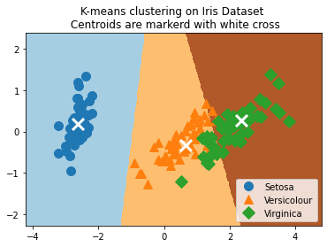
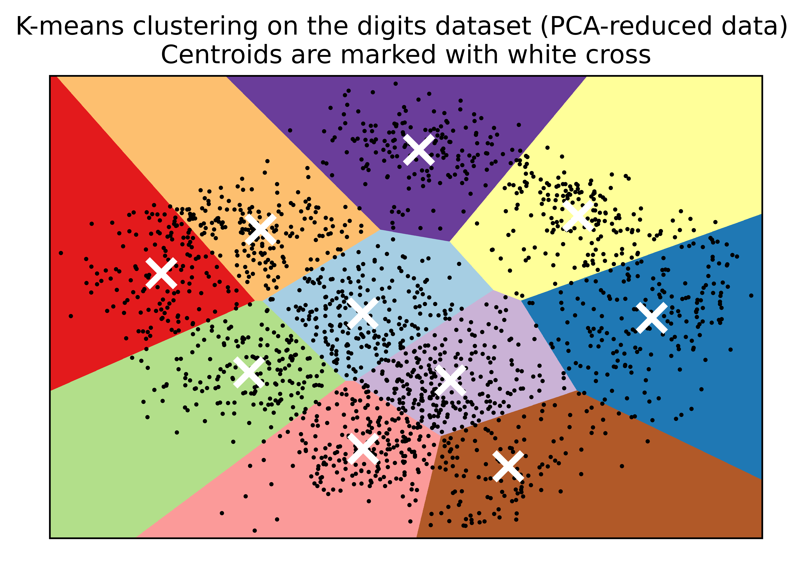

.. code:: python

    # K-means Clustering
    import numpy as np
    import tensorflow.compat.v1 as tf
    # unknown reason
    from scipy.spatial import cKDTree
    # in order to plot four-dimension data into two-dimension plot
    from sklearn.decomposition import PCA
    # import iris datasets
    from sklearn import datasets
    from sklearn.preprocessing import scale
    # plot tools
    import matplotlib.pyplot as plt
    import pandas as pd

.. parsed-literal::

    /opt/anaconda3/lib/python3.8/site-packages/requests/__init__.py:89: RequestsDependencyWarning: urllib3 (1.26.8) or chardet (3.0.4) doesn't match a supported version!
      warnings.warn("urllib3 ({}) or chardet ({}) doesn't match a supported "

.. code:: python

    tf.disable_eager_execution()
    tf.disable_v2_behavior()

.. parsed-literal::

    WARNING:tensorflow:From /opt/anaconda3/lib/python3.8/site-packages/tensorflow/python/compat/v2_compat.py:111: disable_resource_variables (from tensorflow.python.ops.variable_scope) is deprecated and will be removed in a future version.
    Instructions for updating:
    non-resource variables are not supported in the long term

.. code:: python

    iris = datasets.load_iris()

.. code:: python

    iris_data = pd.DataFrame(data = iris.data)

.. code:: python

    iris_data

.. raw:: html

    

    
    <table border="1" class="dataframe">
      <thead>
        <tr style="text-align: right;">
          <th></th>
          <th>0</th>
          <th>1</th>
          <th>2</th>
          <th>3</th>
        </tr>
      </thead>
      <tbody>
        <tr>
          <th>0</th>
          <td>5.1</td>
          <td>3.5</td>
          <td>1.4</td>
          <td>0.2</td>
        </tr>
        <tr>
          <th>1</th>
          <td>4.9</td>
          <td>3.0</td>
          <td>1.4</td>
          <td>0.2</td>
        </tr>
        <tr>
          <th>2</th>
          <td>4.7</td>
          <td>3.2</td>
          <td>1.3</td>
          <td>0.2</td>
        </tr>
        <tr>
          <th>3</th>
          <td>4.6</td>
          <td>3.1</td>
          <td>1.5</td>
          <td>0.2</td>
        </tr>
        <tr>
          <th>4</th>
          <td>5.0</td>
          <td>3.6</td>
          <td>1.4</td>
          <td>0.2</td>
        </tr>
        <tr>
          <th>...</th>
          <td>...</td>
          <td>...</td>
          <td>...</td>
          <td>...</td>
        </tr>
        <tr>
          <th>145</th>
          <td>6.7</td>
          <td>3.0</td>
          <td>5.2</td>
          <td>2.3</td>
        </tr>
        <tr>
          <th>146</th>
          <td>6.3</td>
          <td>2.5</td>
          <td>5.0</td>
          <td>1.9</td>
        </tr>
        <tr>
          <th>147</th>
          <td>6.5</td>
          <td>3.0</td>
          <td>5.2</td>
          <td>2.0</td>
        </tr>
        <tr>
          <th>148</th>
          <td>6.2</td>
          <td>3.4</td>
          <td>5.4</td>
          <td>2.3</td>
        </tr>
        <tr>
          <th>149</th>
          <td>5.9</td>
          <td>3.0</td>
          <td>5.1</td>
          <td>1.8</td>
        </tr>
      </tbody>
    </table>
    
150 rows × 4 columns

    

.. code:: python

    num_pts = len(iris.data)
    num_feats = len(iris.data[0])
    sess = tf.Session()

.. code:: python

    num_pts, num_feats # number of pieces, number of features

.. parsed-literal::

        (150, 4)

.. code:: python

    k = 3
    generations = 25
    data_points = tf.Variable(iris.data)
    cluster_labels = tf.Variable(tf.zeros([num_pts],dtype=tf.int64))

.. code:: python3

    rand_starts = np.array([iris.data[np.random.choice(len(iris.data))] for _ in range(k)])

.. code:: python

    rand_starts

.. parsed-literal::

    array([[5. , 3.3, 1.4, 0.2],
           [5.5, 2.3, 4. , 1.3],
           [6.1, 2.8, 4. , 1.3]])

.. code:: python

    iris.data[1]

.. parsed-literal::

    array([4.9, 3. , 1.4, 0.2])

.. code:: python

    centriods = tf.Variable(rand_starts)

.. code:: python

    centriods

.. parsed-literal::

    <tf.Variable 'Variable_2:0' shape=(3, 4) dtype=float64_ref>

.. code:: python

    k, num_feats # centriods has 3 rows * 4 columns

.. parsed-literal::

    (3, 4)

.. code:: python

    init = tf.initialize_all_variables()
    sess.run(init)

.. parsed-literal::

    WARNING:tensorflow:From /opt/anaconda3/lib/python3.8/site-packages/tensorflow/python/util/tf_should_use.py:247: initialize_all_variables (from tensorflow.python.ops.variables) is deprecated and will be removed after 2017-03-02.
    Instructions for updating:
    Use `tf.global_variables_initializer` instead.

.. code:: python

    centriod_matrix = tf.reshape(tf.tile(centriods, [num_pts, 1]), [num_pts, k, num_feats])
    centriod_matrix

.. parsed-literal::

    <tf.Tensor 'Reshape:0' shape=(150, 3, 4) dtype=float64>

.. code:: python

    centriods.shape # Dimension 3 represents the number of cluster and Dimension 4 represents the number of features.

.. parsed-literal::

    TensorShape([Dimension(3), Dimension(4)])

.. code:: python

    point_matrix = tf.reshape(tf.tile(data_points, [1,k]),[num_pts,k, num_feats])
    point_matrix

.. parsed-literal::

    <tf.Tensor 'Reshape_1:0' shape=(150, 3, 4) dtype=float64>

.. code:: python

    data_points.shape # 150 is the number of sample pieces and 4 is the number of the features

.. parsed-literal::

    TensorShape([Dimension(150), Dimension(4)])

.. code:: python

    tf.tile(data_points, [1,k]).shape

.. parsed-literal::

    TensorShape([Dimension(150), Dimension(12)])

.. code:: python

    distances = tf.reduce_sum(tf.square(point_matrix-centriod_matrix), reduction_indices=2)

.. code:: python

    distances.shape

.. parsed-literal::

    TensorShape([Dimension(150), Dimension(3)])

.. code:: python

    distances_1 = tf.square(point_matrix-centriod_matrix)
    distances_1

.. parsed-literal::

    <tf.Tensor 'Square_1:0' shape=(150, 3, 4) dtype=float64>

.. code:: python

    centriod_group = tf.argmin(distances,1) # why returning the index of the smallest distance between one particular point and three centriods?
    centriod_group
    tf.initialize_all_variables()

.. parsed-literal::

    <tf.Operation 'init_1' type=NoOp>

.. code:: python

    centriod_group.shape

.. parsed-literal::

    TensorShape([Dimension(150)])

.. code:: python

    sum_total = tf.unsorted_segment_sum(data_points,centriod_group,3)

.. code:: python

    num_total = tf.unsorted_segment_sum(tf.ones_like(data_points), centriod_group,3)

.. code:: python

    avg_by_group = sum_total/num_total

.. code:: python

    def data_group_avg(data, group_ids):
        sum_total = tf.unsorted_segment_sum(data,group_ids,3)
        num_total = tf.unsorted_segment_sum(tf.ones_like(data), group_ids,3)
        avg_by_group = sum_total/num_total
        return(avg_by_group)

.. code:: python

    means = data_group_avg(data_points,centriod_group)
    update = tf.group(centriods.assign(means), cluster_labels.assign(centriod_group)) # tf.variable is very important function and should be not 
    # converted into the constants in tensorflow by using sess.run when you want to run for or while loops

.. code:: python

    for i in range(generations):
        print('Calculating generation {}, out of {}'.format(i, generations))
        _, centriod_group_count = sess.run([update, centriod_group])
        group_count = []
        for ix in range(k):
            group_count.append(np.sum(centriod_group_count==ix))
            print('Group counts: {}'.format(group_count))

.. parsed-literal::

    Calculating generation 0, out of 25
    Group counts: [50]
    Group counts: [50, 18]
    Group counts: [50, 18, 82]
    Calculating generation 1, out of 25
    Group counts: [50]
    Group counts: [50, 31]
    Group counts: [50, 31, 69]
    Calculating generation 2, out of 25
    Group counts: [50]
    Group counts: [50, 36]
    Group counts: [50, 36, 64]
    Calculating generation 3, out of 25
    Group counts: [50]
    Group counts: [50, 40]
    Group counts: [50, 40, 60]
    Calculating generation 4, out of 25
    Group counts: [50]
    Group counts: [50, 45]
    Group counts: [50, 45, 55]
    Calculating generation 5, out of 25
    Group counts: [50]
    Group counts: [50, 49]
    Group counts: [50, 49, 51]
    Calculating generation 6, out of 25
    Group counts: [50]
    Group counts: [50, 54]
    Group counts: [50, 54, 46]
    Calculating generation 7, out of 25
    Group counts: [50]
    Group counts: [50, 57]
    Group counts: [50, 57, 43]
    Calculating generation 8, out of 25
    Group counts: [50]
    Group counts: [50, 60]
    Group counts: [50, 60, 40]
    Calculating generation 9, out of 25
    Group counts: [50]
    Group counts: [50, 61]
    Group counts: [50, 61, 39]
    Calculating generation 10, out of 25
    Group counts: [50]
    Group counts: [50, 61]
    Group counts: [50, 61, 39]
    Calculating generation 11, out of 25
    Group counts: [50]
    Group counts: [50, 61]
    Group counts: [50, 61, 39]
    Calculating generation 12, out of 25
    Group counts: [50]
    Group counts: [50, 61]
    Group counts: [50, 61, 39]
    Calculating generation 13, out of 25
    Group counts: [50]
    Group counts: [50, 61]
    Group counts: [50, 61, 39]
    Calculating generation 14, out of 25
    Group counts: [50]
    Group counts: [50, 61]
    Group counts: [50, 61, 39]
    Calculating generation 15, out of 25
    Group counts: [50]
    Group counts: [50, 61]
    Group counts: [50, 61, 39]
    Calculating generation 16, out of 25
    Group counts: [50]
    Group counts: [50, 61]
    Group counts: [50, 61, 39]
    Calculating generation 17, out of 25
    Group counts: [50]
    Group counts: [50, 61]
    Group counts: [50, 61, 39]
    Calculating generation 18, out of 25
    Group counts: [50]
    Group counts: [50, 61]
    Group counts: [50, 61, 39]
    Calculating generation 19, out of 25
    Group counts: [50]
    Group counts: [50, 61]
    Group counts: [50, 61, 39]
    Calculating generation 20, out of 25
    Group counts: [50]
    Group counts: [50, 61]
    Group counts: [50, 61, 39]
    Calculating generation 21, out of 25
    Group counts: [50]
    Group counts: [50, 61]
    Group counts: [50, 61, 39]
    Calculating generation 22, out of 25
    Group counts: [50]
    Group counts: [50, 61]
    Group counts: [50, 61, 39]
    Calculating generation 23, out of 25
    Group counts: [50]
    Group counts: [50, 61]
    Group counts: [50, 61, 39]
    Calculating generation 24, out of 25
    Group counts: [50]
    Group counts: [50, 61]
    Group counts: [50, 61, 39]

.. code:: python

    [centers, assignments] = sess.run([centriods,cluster_labels])

.. code:: python

    assignments

.. parsed-literal::

    array([0, 0, 0, 0, 0, 0, 0, 0, 0, 0, 0, 0, 0, 0, 0, 0, 0, 0, 0, 0, 0, 0,
           0, 0, 0, 0, 0, 0, 0, 0, 0, 0, 0, 0, 0, 0, 0, 0, 0, 0, 0, 0, 0, 0,
           0, 0, 0, 0, 0, 0, 2, 1, 2, 1, 1, 1, 1, 1, 1, 1, 1, 1, 1, 1, 1, 1,
           1, 1, 1, 1, 1, 1, 1, 1, 1, 1, 1, 2, 1, 1, 1, 1, 1, 1, 1, 1, 1, 1,
           1, 1, 1, 1, 1, 1, 1, 1, 1, 1, 1, 1, 2, 1, 2, 2, 2, 2, 1, 2, 2, 2,
           2, 2, 2, 1, 1, 2, 2, 2, 2, 1, 2, 1, 2, 1, 2, 2, 1, 1, 2, 2, 2, 2,
           2, 1, 2, 2, 2, 2, 1, 2, 2, 2, 1, 2, 2, 2, 1, 2, 2, 1])

.. code:: python

    max(set(list(assignments)[100:150]), key=list(assignments)[100:150].count)

.. parsed-literal::

    2

.. code:: python

    [centers, assignments] = sess.run([centriods, cluster_labels])
    def most_common(my_list):
        return(max(set(my_list), key= my_list.count))
    label0 = most_common(list(assignments)[0:50])
    label1 = most_common(list(assignments)[50:100])
    label2 = most_common(list(assignments)[100:150])
    group0_count = np.sum(assignments[0:50]==label0)
    group1_count = np.sum(assignments[50:100]==label1)
    group2_count = np.sum(assignments[100:150]==label2)
    print('Accuarcy: {}'.format((group0_count+group1_count+group2_count)/150))

.. parsed-literal::

    Accuarcy: 0.8866666666666667

.. code:: python

    pca_model = PCA(n_components=2)
    reduced_data = pca_model.fit_transform(iris.data)
    reduced_centers = pca_model.transform(centers)
    h = .02
    x_min, x_max = reduced_data[:,0].min()-1, reduced_data[:,0].max()+1
    y_min, y_max = reduced_data[:,1].min()-1, reduced_data[:,1].max()+1
    xx, yy = np.meshgrid(np.arange(x_min,x_max,h),np.arange(y_min,y_max,h))
    xx_pt = list(xx.ravel())
    yy_pt = list(yy.ravel())
    xy_pts = np.array([[x,y] for x, y in zip(xx_pt,yy_pt)])
    mytree = cKDTree(reduced_centers)
    dist, indexes = mytree.query(xy_pts)
    indexes = indexes.reshape(xx.shape)
    plt.clf()
    plt.imshow(indexes, interpolation='nearest', extent=(xx.min(),xx.max(),yy.min(),yy.max()),
              cmap = plt.cm.Paired,aspect = 'auto', origin = 'lower')
    symbols = ['o', '^', 'D']
    label_name = ['Setosa', 'Versicolour','Virginica']
    for i in range(3):
        temp_group = reduced_data[(i*50):(50)*(i+1)]
        plt.plot(temp_group[:,0],temp_group[:,1],symbols[i], markersize = 10, label = label_name[i])
    plt.scatter(reduced_centers[:, 0], reduced_centers[:,1], marker='x', s = 169, linewidths =3, color='w',zorder=10)
    plt.title('K-means clustering on Iris Dataset \n Centroids are markerd with white cross')
    plt.xlim(x_min, x_max)
    plt.ylim(y_min, y_max)
    plt.legend(loc='lower right')
    plt.show()

K-Means clustering on the handwritten digits data
-------------------------------------------------

.. code:: python

    # load the dataset

.. code:: python

    import numpy as np
    from sklearn.datasets import load_digits # digits datasets. Labels: 0,1,2,3,4,5,6,7,8,9. Features: 64 (grey image size: 8 width * 8 height).
    # Sample size: 1797 
    data, labels = load_digits(return_X_y=True)
    (n_samples, n_features), n_digits = data.shape, np.unique(labels).size

.. code:: python

    data

.. parsed-literal::

    array([[ 0.,  0.,  5., ...,  0.,  0.,  0.],
           [ 0.,  0.,  0., ..., 10.,  0.,  0.],
           [ 0.,  0.,  0., ..., 16.,  9.,  0.],
           ...,
           [ 0.,  0.,  1., ...,  6.,  0.,  0.],
           [ 0.,  0.,  2., ..., 12.,  0.,  0.],
           [ 0.,  0., 10., ..., 12.,  1.,  0.]])

.. code:: python

    labels

.. parsed-literal::

    array([0, 1, 2, ..., 8, 9, 8])

.. code:: python

    n_samples, n_features

.. parsed-literal::

    (1797, 64)

.. code:: python

    n_digits

.. parsed-literal::

    10

.. code:: python

    print(f"# digits: {n_digits}; # samples: {n_samples}; # features: {n_features}")

.. parsed-literal::

    # digits: 10; # samples: 1797; # features: 64

.. code:: python

    # kmeans = KMeans(init="kmeans++",n_cluster=n_digits, n_init=4, random_state=0)

.. code:: python

    from time import time # timing 
    from sklearn import metrics # metrics module for evaluation of performance: including score functions, performance metrics
    from sklearn.pipeline import make_pipeline
    from sklearn.preprocessing import StandardScaler
    
    def bench_k_means(kmeans, name, data, labels):
        """ Benchmark to evaluate the KMeans initialzation methods.
        
        Parameters
        ----------
        kmeans: KMeans instance
             A: class: '-sklearn.cluster.KMeans' instance with the initialization already set.
        name: str
                Name given to the strategy. It will be used to show the results in a table.
        data: ndarray of shape (n_samples,)
              The labels used to compute the clustering metrics which requires some supervision.
        """
        t0 = time() # time clock starts
        estimator = make_pipeline(StandardScaler(), kmeans).fit(data)
        fit_time = time()-t0 # time clock ends. Fit-time is the time for the estimator
        results = [name, fit_time, estimator[-1].inertia_]
        
        # Define the metrics which require only the true labels and estimator labels
        clustering_metrics = [
            metrics.homogeneity_score,
            metrics.completeness_score,
            metrics.v_measure_score,
            metrics.adjusted_rand_score,
            metrics.adjusted_mutual_info_score,
        ]
        results += [m(labels, estimator[-1].labels_) for m in clustering_metrics]
        
        # The silhouette score requires the full dataset
        results += [
            metrics.silhouette_score(
            data,
            estimator[-1].labels_,
            metric = "euclidean",
            sample_size = 300,
            )
        ]
        
        # Show the results
        formatter_result = (
        "{:9s}\t{:.3f}s\t{:.0f}\t{:.3f}\t{:.3f}\t{:.3f}\t{:.3f}\t{:.3f}"
        )
        print(formatter_result.format(*results))

.. code:: python

    from sklearn.cluster import KMeans
    from sklearn.decomposition import PCA
    print(82*'-')
    print("init\t\ttime\tinertia\thomo\tcompl\tv-meas\tARI\tAMI\tsilhouette")
    kmeans = KMeans(init="k-means++", n_clusters = n_digits, n_init=4, random_state = 0)
    bench_k_means(kmeans=kmeans, name= "k-means++", data = data, labels=labels)
    
    kmeans = KMeans(init="random", n_clusters = n_digits, n_init=4, random_state = 0)
    bench_k_means(kmeans=kmeans, name="random", data=data, labels=labels)
    
    pca = PCA(n_components=n_digits).fit(data)
    kmeans = KMeans(init=pca.components_,n_clusters=n_digits,n_init=1)
    bench_k_means(kmeans=kmeans,name="PCA-based", data=data, labels=labels)
    print(82*'-')

.. parsed-literal::

    ----------------------------------------------------------------------------------
    init		time	inertia	homo	compl	v-meas	ARI	AMI	silhouette
    k-means++	0.126s	69485	0.613	0.660	0.636	0.482	0.632
    random   	0.043s	69952	0.545	0.616	0.578	0.415	0.574
    PCA-based	0.019s	72686	0.636	0.658	0.647	0.521	0.643
    ----------------------------------------------------------------------------------

.. code:: python

    import matplotlib.pyplot as plt
    reduced_data = PCA(n_components=2).fit_transform(data)
    kmeans = KMeans(init="random", n_clusters=n_digits, n_init=4)
    kmeans.fit(reduced_data)
    
    h = 0.02
    x_min, x_max = reduced_data[:,0].min()-1, reduced_data[:,0].max()+1
    y_min, y_max = reduced_data[:,1].min()-1, reduced_data[:,1].max()+1
    xx, yy = np.meshgrid(np.arange(x_min,x_max,h), np.arange(y_min,y_max,h))
    
    Z = kmeans.predict(np.c_[xx.ravel(), yy.ravel()])
    
    Z = Z.reshape(xx.shape)
    plt.figure()
    plt.clf()
    plt.figure(dpi=1000)
    plt.imshow(
        Z,
        interpolation="nearest",
        extent = (xx.min(), xx.max(), yy.min(), yy.max()),
        cmap = plt.cm.Paired,
        aspect = "auto",
        origin= "lower",
    )
    plt.plot(reduced_data[:,0],reduced_data[:,1], 'k.', markersize=2)
    centroids = kmeans.cluster_centers_
    plt.scatter(
        centroids[:,0],
        centroids[:,1],
        marker = "x",
        s=169,
        linewidths=3,
        color = "w",
        zorder = 10,
    )
    plt.title(
            "K-means clustering on the digits dataset (PCA-reduced data) \n"
            "Centroids are marked with white cross"
    )
    plt.xlim(x_min,x_max)
    plt.ylim(y_min,y_max)
    plt.xticks(())
    plt.yticks(())
    plt.show()

.. parsed-literal::

    <Figure size 432x288 with 0 Axes>

K-Means Clustering of Iris Dataset
----------------------------------

.. code:: python

    sess = tf.Session()
    iris = datasets.load_iris()
    num_pts = len(iris.data)
    num_feats = len(iris.data[0])
    k = 3
    generations = 25
    data_points = tf.Variable(iris.data)
    cluster_labels = tf.Variable(tf.zeros([num_pts],dtype=tf.int64))
    rand_starts = np.array([iris.data[np.random.choice(len(iris.data))] for _ in range(k)])
    centriods = tf.Variable(rand_starts)
    centriod_matrix = tf.reshape(tf.tile(centriods, [num_pts,1]), [num_pts, k, num_feats])
    point_matrix = tf.reshape(tf.tile(data_points, [1,k]),[num_pts,k,num_feats])
    distances = tf.reduce_sum(tf.square(point_matrix-centriod_matrix), reduction_indices=2)
    centriod_group = tf.argmin(distances,1)
    def data_group_avg(group_ids, data):
        sum_total = tf.unsorted_segment_sum(data, group_ids,3)
        num_total = tf.unsorted_segment_sum(tf.ones_like(data), group_ids,3)
        avg_by_group = sum_total/num_total
        return(avg_by_group)
    means = data_group_avg(centriod_group, data_points)
    update = tf.group(centriods.assign(means), cluster_labels.assign(centriod_group))
    init = tf.initialize_all_variables()
    sess.run(init)
    for i in range(generations):
        print('Calculating gen {}, out of {}'.format(i, generations))
        _, centriod_group_count = sess.run([update, centriod_group])
        group_count = []
        for ix in range(k):
            group_count.append(np.sum(centriod_group_count==ix))
        print("Group counts: {}".format(group_count))
    #[centers, assignments] = sess.run([centroids, cluster_labels])
    def most_common(my_list):
        return(max(set(my_list), key = my_list.count))
    label0 = most_common(list(assignments[0:50]))
    label1 = most_common(list(assignments[50:100]))
    label2 = most_common(list(assignments[100:150]))
    group0_count = np.sum(assignments[0:50]==label0)
    group1_count = np.sum(assignments[50:100]==label1)
    group2_count = np.sum(assignments[100:150]==label2)
    accuracy = (group0_count+group1_count+group2_count)/150.
    print('Accuracy: {:.2f}'.format(accuracy))

.. parsed-literal::

    Calculating gen 0, out of 25
    Group counts: [21, 79, 50]
    Calculating gen 1, out of 25
    Group counts: [31, 69, 50]
    Calculating gen 2, out of 25
    Group counts: [36, 64, 50]
    Calculating gen 3, out of 25
    Group counts: [40, 60, 50]
    Calculating gen 4, out of 25
    Group counts: [45, 55, 50]
    Calculating gen 5, out of 25
    Group counts: [49, 51, 50]
    Calculating gen 6, out of 25
    Group counts: [54, 46, 50]
    Calculating gen 7, out of 25
    Group counts: [57, 43, 50]
    Calculating gen 8, out of 25
    Group counts: [60, 40, 50]
    Calculating gen 9, out of 25
    Group counts: [61, 39, 50]
    Calculating gen 10, out of 25
    Group counts: [61, 39, 50]
    Calculating gen 11, out of 25
    Group counts: [61, 39, 50]
    Calculating gen 12, out of 25
    Group counts: [61, 39, 50]
    Calculating gen 13, out of 25
    Group counts: [61, 39, 50]
    Calculating gen 14, out of 25
    Group counts: [61, 39, 50]
    Calculating gen 15, out of 25
    Group counts: [61, 39, 50]
    Calculating gen 16, out of 25
    Group counts: [61, 39, 50]
    Calculating gen 17, out of 25
    Group counts: [61, 39, 50]
    Calculating gen 18, out of 25
    Group counts: [61, 39, 50]
    Calculating gen 19, out of 25
    Group counts: [61, 39, 50]
    Calculating gen 20, out of 25
    Group counts: [61, 39, 50]
    Calculating gen 21, out of 25
    Group counts: [61, 39, 50]
    Calculating gen 22, out of 25
    Group counts: [61, 39, 50]
    Calculating gen 23, out of 25
    Group counts: [61, 39, 50]
    Calculating gen 24, out of 25
    Group counts: [61, 39, 50]
    Accuracy: 0.89

.. code:: python

    # To visually see our groupings and if they have indeed separated out the iris species, we will transform the four dimensions to
    # two dimensions using PCA, and plot the data points and groups. After the PCA decomposition, we create predictions on a grid of
    # x-y values for plotting a color graph:
    pca_model = PCA(n_components=2)
    reduced_data = pca_model.fit_transform(iris.data)

.. code:: python

    iris.data.shape, reduced_data.shape

.. parsed-literal::

    ((150, 4), (150, 2))

.. code:: python

    centers

.. parsed-literal::

    array([[5.006     , 3.428     , 1.462     , 0.246     ],
           [5.88360656, 2.74098361, 4.38852459, 1.43442623],
           [6.85384615, 3.07692308, 5.71538462, 2.05384615]])

.. code:: python

    # Transform centers
    reduced_centers = pca_model.transform(centers)

.. code:: python

    reduced_centers

.. parsed-literal::

    array([[-2.64241546,  0.19088505],
           [ 0.66567601, -0.3316042 ],
           [ 2.34652659,  0.27393856]])

