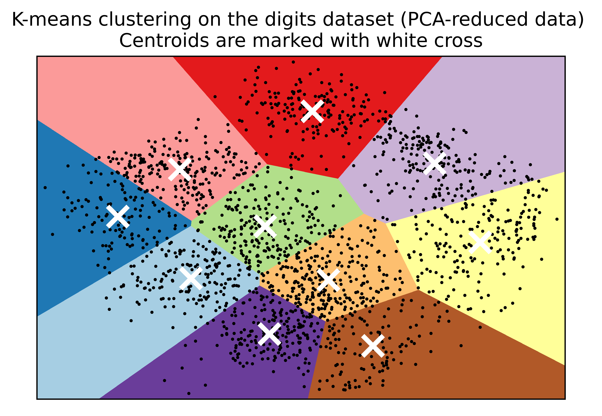

.. code:: ipython3

    # K-means Clustering
    import numpy as np
    import tensorflow.compat.v1 as tf
    # unknown reason
    from scipy.spatial import cKDTree
    # in order to plot four-dimension data into two-dimension plot
    from sklearn.decomposition import PCA
    # import iris datasets
    from sklearn import datasets
    from sklearn.preprocessing import scale
    # plot tools
    import matplotlib.pyplot as plt
    import pandas as pd

.. code:: ipython3

    tf.disable_eager_execution()
    tf.disable_v2_behavior()

.. parsed-literal::

    WARNING:tensorflow:From /opt/anaconda3/lib/python3.8/site-packages/tensorflow/python/compat/v2_compat.py:111: disable_resource_variables (from tensorflow.python.ops.variable_scope) is deprecated and will be removed in a future version.
    Instructions for updating:
    non-resource variables are not supported in the long term

.. code:: ipython3

    iris = datasets.load_iris()

.. code:: ipython3

    iris_data = pd.DataFrame(data = iris.data)

.. code:: ipython3

    iris_data

.. raw:: html

    

    
    <table border="1" class="dataframe">
      <thead>
        <tr style="text-align: right;">
          <th></th>
          <th>0</th>
          <th>1</th>
          <th>2</th>
          <th>3</th>
        </tr>
      </thead>
      <tbody>
        <tr>
          <th>0</th>
          <td>5.1</td>
          <td>3.5</td>
          <td>1.4</td>
          <td>0.2</td>
        </tr>
        <tr>
          <th>1</th>
          <td>4.9</td>
          <td>3.0</td>
          <td>1.4</td>
          <td>0.2</td>
        </tr>
        <tr>
          <th>2</th>
          <td>4.7</td>
          <td>3.2</td>
          <td>1.3</td>
          <td>0.2</td>
        </tr>
        <tr>
          <th>3</th>
          <td>4.6</td>
          <td>3.1</td>
          <td>1.5</td>
          <td>0.2</td>
        </tr>
        <tr>
          <th>4</th>
          <td>5.0</td>
          <td>3.6</td>
          <td>1.4</td>
          <td>0.2</td>
        </tr>
        <tr>
          <th>...</th>
          <td>...</td>
          <td>...</td>
          <td>...</td>
          <td>...</td>
        </tr>
        <tr>
          <th>145</th>
          <td>6.7</td>
          <td>3.0</td>
          <td>5.2</td>
          <td>2.3</td>
        </tr>
        <tr>
          <th>146</th>
          <td>6.3</td>
          <td>2.5</td>
          <td>5.0</td>
          <td>1.9</td>
        </tr>
        <tr>
          <th>147</th>
          <td>6.5</td>
          <td>3.0</td>
          <td>5.2</td>
          <td>2.0</td>
        </tr>
        <tr>
          <th>148</th>
          <td>6.2</td>
          <td>3.4</td>
          <td>5.4</td>
          <td>2.3</td>
        </tr>
        <tr>
          <th>149</th>
          <td>5.9</td>
          <td>3.0</td>
          <td>5.1</td>
          <td>1.8</td>
        </tr>
      </tbody>
    </table>
    
150 rows × 4 columns

    

.. code:: ipython3

    num_pts = len(iris.data)
    num_feats = len(iris.data[0])
    sess = tf.Session()

.. code:: ipython3

    num_pts, num_feats # number of pieces, number of features

.. parsed-literal::

    (150, 4)

.. code:: ipython3

    k = 3
    generations = 25
    data_points = tf.Variable(iris.data)
    cluster_labels = tf.Variable(tf.zeros([num_pts],dtype=tf.int64))

.. code:: ipython3

    rand_starts = np.array([iris.data[np.random.choice(len(iris.data))] for _ in range(k)])

.. code:: ipython3

    rand_starts

.. parsed-literal::

    array([[5. , 3.5, 1.3, 0.3],
           [6.3, 3.4, 5.6, 2.4],
           [5.2, 4.1, 1.5, 0.1]])

.. code:: ipython3

    iris.data[1]

.. parsed-literal::

    array([4.9, 3. , 1.4, 0.2])

.. code:: ipython3

    centriods = tf.Variable(rand_starts)

.. code:: ipython3

    centriods

.. parsed-literal::

    <tf.Variable 'Variable_2:0' shape=(3, 4) dtype=float64_ref>

K-Means clustering on the handwritten digits data
-------------------------------------------------

.. code:: ipython3

    # load the dataset

.. code:: ipython3

    import numpy as np
    from sklearn.datasets import load_digits # digits datasets. Labels: 0,1,2,3,4,5,6,7,8,9. Features: 64 (grey image size: 8 width * 8 height).
    # Sample size: 1797 
    data, labels = load_digits(return_X_y=True)
    (n_samples, n_features), n_digits = data.shape, np.unique(labels).size

.. code:: ipython3

    data

.. parsed-literal::

    array([[ 0.,  0.,  5., ...,  0.,  0.,  0.],
           [ 0.,  0.,  0., ..., 10.,  0.,  0.],
           [ 0.,  0.,  0., ..., 16.,  9.,  0.],
           ...,
           [ 0.,  0.,  1., ...,  6.,  0.,  0.],
           [ 0.,  0.,  2., ..., 12.,  0.,  0.],
           [ 0.,  0., 10., ..., 12.,  1.,  0.]])

.. code:: ipython3

    labels

.. parsed-literal::

    array([0, 1, 2, ..., 8, 9, 8])

.. code:: ipython3

    n_samples, n_features

.. parsed-literal::

    (1797, 64)

.. code:: ipython3

    n_digits

.. parsed-literal::

    10

.. code:: ipython3

    print(f"# digits: {n_digits}; # samples: {n_samples}; # features: {n_features}")

.. parsed-literal::

    # digits: 10; # samples: 1797; # features: 64

.. code:: ipython3

    # kmeans = KMeans(init="kmeans++",n_cluster=n_digits, n_init=4, random_state=0)

.. code:: ipython3

    estimator = make_pipeline(StandardScaler(),kmeans).fit(data)
    estimator[-1].labels_

.. parsed-literal::

    array([4, 8, 8, ..., 8, 1, 1], dtype=int32)

.. code:: ipython3

    from time import time # timing 
    from sklearn import metrics # metrics module for evaluation of performance: including score functions, performance metrics
    from sklearn.pipeline import make_pipeline
    from sklearn.preprocessing import StandardScaler
    
    def bench_k_means(kmeans, name, data, labels):
        """ Benchmark to evaluate the KMeans initialzation methods.
        
        Parameters
        ----------
        kmeans: KMeans instance
             A: class: '-sklearn.cluster.KMeans' instance with the initialization already set.
        name: str
                Name given to the strategy. It will be used to show the results in a table.
        data: ndarray of shape (n_samples,)
              The labels used to compute the clustering metrics which requires some supervision.
        """
        t0 = time() # time clock starts
        estimator = make_pipeline(StandardScaler(), kmeans).fit(data)
        fit_time = time()-t0 # time clock ends. Fit-time is the time for the estimator
        results = [name, fit_time, estimator[-1].inertia_]
        
        # Define the metrics which require only the true labels and estimator labels
        clustering_metrics = [
            metrics.homogeneity_score,
            metrics.completeness_score,
            metrics.v_measure_score,
            metrics.adjusted_rand_score,
            metrics.adjusted_mutual_info_score,
        ]
        results += [m(labels, estimator[-1].labels_) for m in clustering_metrics]
        
        # The silhouette score requires the full dataset
        results += [
            metrics.silhouette_score(
            data,
            estimator[-1].labels_,
            metric = "euclidean",
            sample_size = 300,
            )
        ]
        
        # Show the results
        formatter_result = (
        "{:9s}\t{:.3f}s\t{:.0f}\t{:.3f}\t{:.3f}\t{:.3f}\t{:.3f}\t{:.3f}"
        )
        print(formatter_result.format(*results))

.. code:: ipython3

    from sklearn.cluster import KMeans
    from sklearn.decomposition import PCA
    print(82*'-')
    print("init\t\ttime\tinertia\thomo\tcompl\tv-meas\tARI\tAMI\tsilhouette")
    kmeans = KMeans(init="k-means++", n_clusters = n_digits, n_init=4, random_state = 0)
    bench_k_means(kmeans=kmeans, name= "k-means++", data = data, labels=labels)
    
    kmeans = KMeans(init="random", n_clusters = n_digits, n_init=4, random_state = 0)
    bench_k_means(kmeans=kmeans, name="random", data=data, labels=labels)
    
    pca = PCA(n_components=n_digits).fit(data)
    kmeans = KMeans(init=pca.components_,n_clusters=n_digits,n_init=1)
    bench_k_means(kmeans=kmeans,name="PCA-based", data=data, labels=labels)
    print(82*'-')

.. parsed-literal::

    ----------------------------------------------------------------------------------
    init		time	inertia	homo	compl	v-meas	ARI	AMI	silhouette
    k-means++	0.144s	69485	0.613	0.660	0.636	0.482	0.632
    random   	0.047s	69952	0.545	0.616	0.578	0.415	0.574
    PCA-based	0.027s	72686	0.636	0.658	0.647	0.521	0.643
    ----------------------------------------------------------------------------------

.. code:: ipython3

    import matplotlib.pyplot as plt
    reduced_data = PCA(n_components=2).fit_transform(data)
    kmeans = KMeans(init="random", n_clusters=n_digits, n_init=4)
    kmeans.fit(reduced_data)
    
    h = 0.02
    x_min, x_max = reduced_data[:,0].min()-1, reduced_data[:,0].max()+1
    y_min, y_max = reduced_data[:,1].min()-1, reduced_data[:,1].max()+1
    xx, yy = np.meshgrid(np.arange(x_min,x_max,h), np.arange(y_min,y_max,h))
    
    Z = kmeans.predict(np.c_[xx.ravel(), yy.ravel()])
    
    Z = Z.reshape(xx.shape)
    plt.figure()
    plt.clf()
    plt.figure(dpi=1000)
    plt.imshow(
        Z,
        interpolation="nearest",
        extent = (xx.min(), xx.max(), yy.min(), yy.max()),
        cmap = plt.cm.Paired,
        aspect = "auto",
        origin= "lower",
    )
    plt.plot(reduced_data[:,0],reduced_data[:,1], 'k.', markersize=2)
    centroids = kmeans.cluster_centers_
    plt.scatter(
        centroids[:,0],
        centroids[:,1],
        marker = "x",
        s=169,
        linewidths=3,
        color = "w",
        zorder = 10,
    )
    plt.title(
            "K-means clustering on the digits dataset (PCA-reduced data) \n"
            "Centroids are marked with white cross"
    )
    plt.xlim(x_min,x_max)
    plt.ylim(y_min,y_max)
    plt.xticks(())
    plt.yticks(())
    plt.show()

.. parsed-literal::

    <Figure size 432x288 with 0 Axes>

