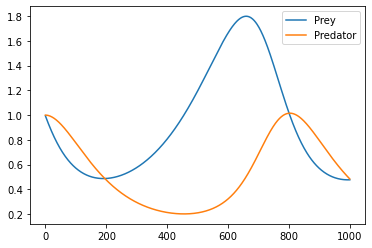

.. code:: ipython3

    import matplotlib.pyplot as plt
    import tensorflow.compat.v1 as tf

.. code:: ipython3

    tf.disable_eager_execution()
    tf.disable_v2_behavior()
    sess = tf.Session()

.. parsed-literal::

    WARNING:tensorflow:From /opt/anaconda3/lib/python3.8/site-packages/tensorflow/python/compat/v2_compat.py:111: disable_resource_variables (from tensorflow.python.ops.variable_scope) is deprecated and will be removed in a future version.
    Instructions for updating:
    non-resource variables are not supported in the long term

.. code:: ipython3

    x_initial = tf.constant(1.0)
    y_initial = tf.constant(1.0)
    x_t1 = tf.Variable(x_initial)
    y_t1 = tf.Variable(y_initial)
    delta_t = tf.placeholder(tf.float32, shape=())

.. code:: ipython3

    a= tf.placeholder(tf.float32, shape=())
    b = tf.placeholder(tf.float32, shape=())
    c = tf.placeholder(tf.float32, shape=())
    d = tf.placeholder(tf.float32, shape=())
    x_t2 = x_t1+(a*x_t1+b*x_t1*y_t1)*delta_t
    y_t2 = y_t1+(c*y_t1+d*x_t1*y_t1)*delta_t
    step = tf.group(x_t1.assign(x_t2), y_t1.assign(y_t2))

.. code:: ipython3

    init = tf.initialize_all_variables()
    sess.run(init)

.. parsed-literal::

    WARNING:tensorflow:From /opt/anaconda3/lib/python3.8/site-packages/tensorflow/python/util/tf_should_use.py:247: initialize_all_variables (from tensorflow.python.ops.variables) is deprecated and will be removed after 2017-03-02.
    Instructions for updating:
    Use `tf.global_variables_initializer` instead.

.. code:: ipython3

    prey_values = []
    predator_values = []
    for i in range(1000):
        step.run({a: (2./3.), b: (-4./3.), c: -1.0, d: 1.0, delta_t: 0.01},session=sess)
        temp_prey, temp_pred = sess.run([x_t1, y_t1])
        prey_values.append(temp_prey)
        predator_values.append(temp_pred)

.. code:: ipython3

    plt.plot(prey_values, label="Prey")
    plt.plot(predator_values, label="Predator")
    plt.legend(loc='upper right')
    plt.show()

